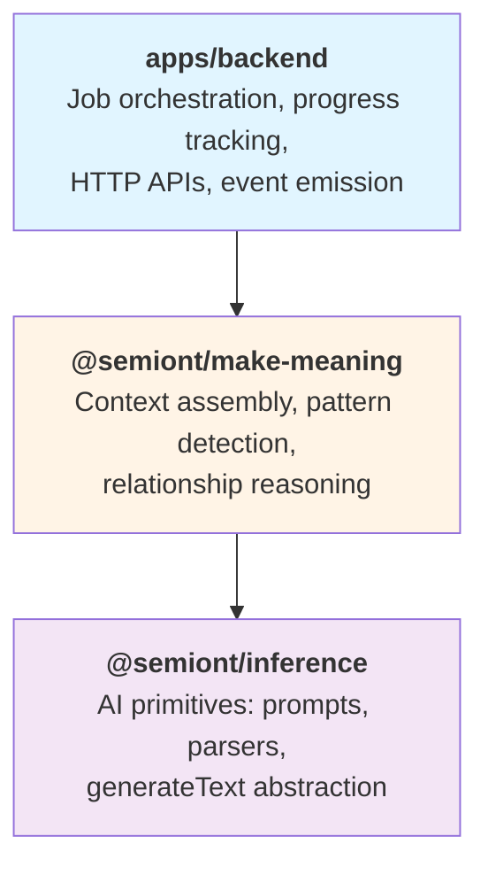

# Architecture

`@semiont/make-meaning` implements a **three-layer architecture** for making meaning from resources.

## Three-Layer Design



### Layer Responsibilities

**Backend** (apps/backend):
- HTTP request handling
- Job queue management
- Worker orchestration
- Progress tracking and SSE streaming
- Event Store initialization

**Make-Meaning** (this package):
- Context assembly from event-sourced storage
- AI-powered pattern detection
- Graph traversal and relationship reasoning
- GraphDB event consumer (RxJS burst-buffered pipeline)
- Job worker implementations
- Annotation creation logic

**Inference** ([@semiont/inference](../../inference/)):
- AI prompt construction
- Response parsing and validation
- `generateText()` abstraction over AI providers
- Domain-agnostic AI primitives

## Key Principles

### Event-Sourced Context

Resources and annotations are assembled from event streams via view storage:

```typescript
// Resource metadata comes from view storage (event-sourced)
const resource = await ResourceContext.getResourceMetadata(resourceId, config);

// Annotations come from view storage projection
const annotations = await AnnotationContext.getResourceAnnotations(resourceId, config);
```

View storage maintains projections of current state by replaying events:
- `resource.created` → Resource view
- `annotation.added` → Annotation projection
- `annotation.body.updated` → Body updates

### Content-Addressed Storage

Content is stored and retrieved using checksums:

```typescript
// Store content with checksum
const { checksum } = await repStore.store(buffer, { mediaType: 'text/markdown' });

// Retrieve by checksum (deduplication, caching)
const content = await repStore.retrieve(checksum, 'text/markdown');
```

Benefits:
- **Deduplication**: Identical content stored once
- **Caching**: Content-addressed lookup enables efficient caching
- **Immutability**: Content never changes (new content = new checksum)

### Graph-Backed Relationships

Resource relationships are traversed via @semiont/graph:

```typescript
// Find resources linking to this one
const backlinks = await GraphContext.getBacklinks(resourceId, config);

// Find shortest path between resources
const paths = await GraphContext.findPath(fromId, toId, config, maxDepth);
```

Graph operations delegate to Neo4j or other graph database implementations.

### Separation of Concerns

**Detection logic** (make-meaning) is separate from **job orchestration** (backend):

```typescript
// Worker orchestration (backend)
class HighlightDetectionWorker extends JobWorker {
  protected async executeJob(job: HighlightDetectionJob) {
    // Progress tracking
    job.progress = { stage: 'analyzing', percentage: 10 };
    await this.updateJobProgress(job);

    // Detection logic (delegated to make-meaning)
    const highlights = await AnnotationDetection.detectHighlights(
      job.resourceId,
      this.config,
      job.instructions,
      job.density
    );

    // Annotation creation via events
    for (const highlight of highlights) {
      await this.createAnnotation(highlight);
    }
  }
}
```

This separation:
- Makes detection logic testable in isolation
- Enables reuse outside job context
- Keeps workers focused on orchestration

## Data Flow

### Detection Pipeline

```
1. HTTP Request (POST /resources/:id/detect-highlights-stream)
   ↓
2. Create Job & Enqueue (backend route handler)
   ↓
3. Worker Polls Job (HighlightDetectionWorker)
   ↓
4. Fetch Resource Content (ResourceContext)
   ↓
5. AI Detection (AnnotationDetection.detectHighlights)
   ├─ Load content from RepresentationStore
   ├─ Build prompt (MotivationPrompts)
   ├─ Call AI (generateText)
   └─ Parse response (MotivationParsers)
   ↓
6. Create Annotations (EventStore.appendEvent)
   ├─ annotation.added events
   └─ View storage updates projections
   ↓
7. Complete Job (job.completed event)
   ↓
8. SSE Stream Updates UI
```

### Context Assembly

```
1. Request Annotation Context
   ↓
2. Fetch from View Storage
   ├─ Get resource view (metadata + content checksum)
   ├─ Get annotation projection (all annotations)
   └─ Filter for specific annotation
   ↓
3. Load Content (if needed)
   ├─ Get checksum from resource representation
   └─ Retrieve from RepresentationStore
   ↓
4. Extract Context
   ├─ Find annotation target (TextPositionSelector)
   ├─ Extract surrounding text (lines before/after)
   └─ Include related annotations
   ↓
5. Return Assembled Context
```

## Storage Architecture

### Event Store

Append-only log of domain events:

```
data/
  events/
    <resource-id>/
      events.ndjson  # Newline-delimited JSON events
```

Events are never modified, only appended.

### View Storage

Projections of current state from events:

```
data/
  views/
    <resource-id>.json  # Current resource state + annotations
```

Views are rebuilt by replaying events from Event Store.

### Representation Store

Content-addressed content storage:

```
data/
  representations/
    <checksum>/
      content  # Raw content bytes
```

Content is immutable and deduplicated by checksum.

### Job Queue

Filesystem-based job queue with in-memory pending queue:

```
data/
  jobs/
    pending/
      <job-id>.json
    running/
      <job-id>.json
    complete/
      <job-id>.json
    failed/
      <job-id>.json
```

Jobs are persisted to disk by status directory. Pending jobs are also held in an in-memory sorted array for fast polling (no filesystem I/O per poll). The in-memory queue is populated at startup and kept in sync via `fs.watch`.

## Dependency Graph

```
@semiont/make-meaning
├── @semiont/core          # Types, utilities, burstBuffer RxJS operator
├── @semiont/api-client    # OpenAPI-generated types
├── @semiont/event-sourcing # Event Store, View Storage
├── @semiont/content       # RepresentationStore
├── @semiont/graph         # Graph database interface + implementations
├── @semiont/ontology      # Tag schemas
├── @semiont/inference     # AI primitives
└── @semiont/jobs          # Job queue, workers
```

## Graph Consumer

The `GraphDBConsumer` (`src/graph/consumer.ts`) subscribes to all events globally and projects graph-relevant events into the graph database. It uses an RxJS pipeline with adaptive burst buffering:

```
EventBus (callback, fire-and-forget)
  → Pre-filter: 9 graph-relevant event types
    → Subject<StoredEvent> (callback-to-RxJS bridge)
      → groupBy(resourceId)        — one stream per resource
        → burstBuffer(50ms, 500, 200ms) — adaptive batching per resource
          → concatMap               — sequential per resource
            → Single event: applyEventToGraph()
            → Batch: processBatch() → batchCreateResources / createAnnotations
```

The `burstBuffer` operator (from `@semiont/core`) passes the first event through immediately for zero-latency interactive use, then batches subsequent events during bursts. After an idle period, it returns to passthrough mode. Batch processing uses bulk graph operations where available (e.g., Neo4j UNWIND queries via `batchCreateResources`).

`rebuildAll()` and `rebuildResource()` bypass the live pipeline — they read events directly from the event store and call `applyEventToGraph()` sequentially.

## Worker Architecture

### Base Class Pattern

All workers extend `JobWorker` from @semiont/jobs:

```typescript
export abstract class JobWorker {
  protected jobQueue: JobQueue;

  constructor(jobQueue: JobQueue) {
    this.jobQueue = jobQueue;
  }

  async start(): Promise<void> {
    while (this.running) {
      const job = await this.pollNextJob(); // Reads from in-memory queue (no fs I/O)
      if (job) await this.processJob(job);
    }
  }

  protected abstract canProcessJob(job: Job): boolean;
  protected abstract executeJob(job: Job): Promise<void>;
}
```

### Dependency Injection

Workers receive dependencies via constructor:

```typescript
class HighlightDetectionWorker extends JobWorker {
  constructor(
    jobQueue: JobQueue,
    private config: EnvironmentConfig,
    private eventStore: EventStore
  ) {
    super(jobQueue);
  }
}
```

No singletons or global state.

### Event Emission

Workers emit domain events through Event Store:

```typescript
// Emit progress event
await this.eventStore.appendEvent({
  type: 'job.progress',
  resourceId: job.resourceId,
  userId: job.userId,
  version: 1,
  payload: {
    jobId: job.id,
    percentage: 50,
    message: 'Processing...'
  }
});
```

Frontend subscribes to SSE stream for real-time updates.

## Future Enhancements

### Deterministic Reasoning

Add non-AI reasoning capabilities:

- **Rule-based pattern matching**: Regex, string matching
- **Ontology-driven inference**: OWL/RDFS reasoning
- **Compositional reasoning**: Combine AI + rules + ontology

### Enhanced Context Assembly

- **Multi-resource context**: Build context spanning multiple resources
- **Temporal context**: Access historical versions
- **Provenance tracking**: Track reasoning chains

### Distributed Processing

- **Multi-worker support**: Scale workers across machines
- **Job priorities**: High-priority jobs process first
- **Dead-letter queue**: Handle permanently failed jobs

## See Also

- [Job Workers](./job-workers.md) - Worker implementations
- [API Reference](./api-reference.md) - Complete API documentation
- [@semiont/inference Architecture](../../inference/docs/architecture.md) - AI layer design
