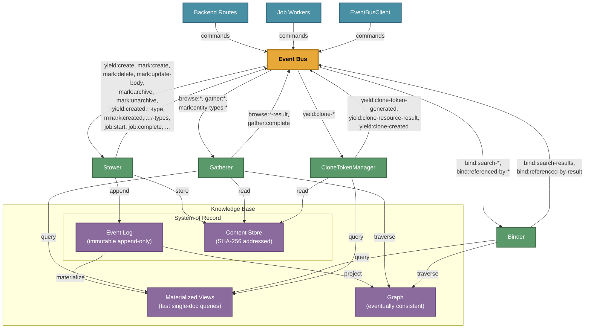

# Architecture

`@semiont/make-meaning` implements the actor model from [ARCHITECTURE.md](../../../docs/ARCHITECTURE.md).

## Actor Model

The package owns the **Knowledge Base** and three actors that interface with it. All communication flows through the **EventBus** — actors subscribe via RxJS pipelines and expose only `initialize()` and `stop()`.


```mermaid
graph TB
    Routes["Backend Routes"] -->|commands| BUS["Event Bus"]
    Workers["Job Workers"] -->|commands| BUS
    EBC["EventBusClient"] -->|commands| BUS

    BUS -->|"yield:create, mark:create,<br/>mark:delete, mark:update-body,<br/>mark:archive, mark:unarchive,<br/>mark:add-entity-type,<br/>mark:update-entity-types,<br/>job:start, job:complete, ..."| STOWER["Stower"]
    BUS -->|"browse:*, gather:*,<br/>mark:entity-types-*"| GATHERER["Gatherer"]
    BUS -->|"bind:search-*,<br/>bind:referenced-by-*"| BINDER["Binder"]
    BUS -->|"yield:clone-*"| CTM["CloneTokenManager"]

    STOWER -->|append| EVENTLOG
    STOWER -->|store| CONTENT

    subgraph kb ["Knowledge Base"]
        subgraph sor ["System of Record"]
            EVENTLOG["Event Log<br/>(immutable append-only)"]
            CONTENT["Content Store<br/>(SHA-256 addressed)"]
        end
        VIEWS["Materialized Views<br/>(fast single-doc queries)"]
        GRAPH["Graph<br/>(eventually consistent)"]

        EVENTLOG -->|materialize| VIEWS
        EVENTLOG -->|project| GRAPH
    end

    GATHERER -->|query| VIEWS
    GATHERER -->|read| CONTENT
    GATHERER -->|traverse| GRAPH

    BINDER -->|query| VIEWS
    BINDER -->|traverse| GRAPH

    CTM -->|query| VIEWS
    CTM -->|read| CONTENT

    STOWER -->|"yield:created,<br/>mark:created, ..."| BUS
    GATHERER -->|"browse:*-result,<br/>gather:complete"| BUS
    BINDER -->|"bind:search-results,<br/>bind:referenced-by-result"| BUS
    CTM -->|"yield:clone-token-generated,<br/>yield:clone-resource-result,<br/>yield:clone-created"| BUS

    classDef bus fill:#e8a838,stroke:#b07818,stroke-width:3px,color:#000,font-weight:bold
    classDef store fill:#8b6b9d,stroke:#6b4a7a,stroke-width:2px,color:#fff
    classDef worker fill:#5a9a6a,stroke:#3d6644,stroke-width:2px,color:#fff
    classDef caller fill:#4a90a4,stroke:#2c5f7a,stroke-width:2px,color:#fff

    class BUS bus
    class EVENTLOG,VIEWS,CONTENT,GRAPH store
    class STOWER,GATHERER,BINDER,CTM worker
    class Routes,Workers,EBC caller
```

## Actors

### Stower (Write Gateway)

**Implementation**: [src/stower.ts](../src/stower.ts)

The single write path to the Knowledge Base. No other code calls `eventStore.appendEvent()` or `repStore.store()`.

**Subscriptions** (EventBus commands → domain events):

| Command | Domain Event | Result Event |
|---------|-------------|-------------|
| `yield:create` | `resource.created` + content store | `yield:created` / `yield:create-failed` |
| `mark:create` | `annotation.added` | `mark:created` / `mark:create-failed` |
| `mark:delete` | `annotation.removed` | `mark:deleted` / `mark:delete-failed` |
| `mark:update-body` | `annotation.body.updated` | `mark:body-updated` |
| `mark:archive` | `resource.archived` | — |
| `mark:unarchive` | `resource.unarchived` | — |
| `mark:add-entity-type` | `entitytype.added` | `mark:entity-type-added` |
| `mark:update-entity-types` | `entitytag.added` / `entitytag.removed` | — |
| `job:start` | `job.started` | — |
| `job:report-progress` | `job.progress` | — |
| `job:complete` | `job.completed` | — |
| `job:fail` | `job.failed` | — |

### Gatherer (Read Actor)

**Implementation**: [src/gatherer.ts](../src/gatherer.ts)

The read actor for the Knowledge Base. Handles all browse reads, context assembly, and entity type listing.

**Pipeline**: `gather:*` events use `groupBy(resourceId)` for per-resource isolation and `concatMap` for ordering. `browse:*` events use `mergeMap` for independent request-response (no grouping needed since they use `correlationId`).

| Request Event | Handler | Result Event |
|--------------|---------|-------------|
| `browse:resource-requested` | `ResourceContext.getResourceMetadata()` + event materialization | `browse:resource-result` / `browse:resource-failed` |
| `browse:resources-requested` | `ResourceContext.listResources()` | `browse:resources-result` / `browse:resources-failed` |
| `browse:annotations-requested` | `AnnotationContext.getAllAnnotations()` | `browse:annotations-result` / `browse:annotations-failed` |
| `browse:annotation-requested` | `AnnotationContext.getAnnotation()` + `ResourceContext.getResourceMetadata()` | `browse:annotation-result` / `browse:annotation-failed` |
| `browse:events-requested` | `EventQuery.queryEvents()` | `browse:events-result` / `browse:events-failed` |
| `browse:annotation-history-requested` | `EventQuery` + annotation event filtering | `browse:annotation-history-result` / `browse:annotation-history-failed` |
| `mark:entity-types-requested` | `readEntityTypesProjection()` | `mark:entity-types-result` / `mark:entity-types-failed` |
| `gather:requested` | `AnnotationContext.buildLLMContext(kb, inferenceClient)` — passage + graph + optional inference summary | `gather:complete` / `gather:failed` |
| `gather:resource-requested` | `LLMContext.getResourceContext(kb)` | `gather:resource-complete` / `gather:resource-failed` |

### Binder (Search/Link Actor)

**Implementation**: [src/binder.ts](../src/binder.ts)

Searches KB stores to resolve entity references and discover relationships. When `bind:search-requested` includes a `context` field (a `GatheredContext`), the Binder runs context-driven search with multi-source candidate retrieval, composite structural scoring, and optional LLM-based semantic scoring.

| Request Event | Handler | Result Event |
|--------------|---------|-------------|
| `bind:search-requested` | Context-driven search (when `context` present) or `kb.graph.searchResources()` (plain) | `bind:search-results` / `bind:search-failed` |
| `bind:referenced-by-requested` | `kb.graph.getResourceReferencedBy()` + resource lookups | `bind:referenced-by-result` / `bind:referenced-by-failed` |

**Context-driven search** retrieves candidates from three sources (name match, entity type filter, graph neighborhood), scores them with structural signals (entity type overlap, bidirectionality, citation weight, name match, recency), and optionally blends LLM semantic relevance scores when an `InferenceClient` is available.

### CloneTokenManager (Clone Token Actor)

**Implementation**: [src/clone-token-manager.ts](../src/clone-token-manager.ts)

Manages the lifecycle of temporary clone tokens for resource cloning. In-memory token store with 15-minute expiry.

| Request Event | Handler | Result Event |
|--------------|---------|-------------|
| `yield:clone-token-requested` | Validate resource + content, generate token | `yield:clone-token-generated` / `yield:clone-token-failed` |
| `yield:clone-resource-requested` | Validate token, look up source resource | `yield:clone-resource-result` / `yield:clone-resource-failed` |
| `yield:clone-create` | Validate token, create resource via `ResourceOperations` | `yield:clone-created` / `yield:clone-create-failed` |

## Knowledge Base

The Knowledge Base is not an intelligent actor. It has no goals, preferences, or decisions. It is inert storage — the durable record of what intelligent actors decide.

**Implementation**: [src/knowledge-base.ts](../src/knowledge-base.ts)

```typescript
export interface KnowledgeBase {
  eventStore: EventStore;        // Event Log (immutable append-only)
  views: ViewStorage;            // Materialized Views (fast reads)
  content: RepresentationStore;  // Content Store (SHA-256 addressed)
  graph: GraphDatabase;          // Graph (eventually consistent)
}
```

The `createKnowledgeBase()` factory instantiates `FilesystemViewStorage` and `FilesystemRepresentationStore` once. Context modules receive `KnowledgeBase` instead of instantiating stores per call.

## Operations

`ResourceOperations` and `AnnotationOperations` are thin facades that emit commands on the EventBus. They do not access KB stores directly — the Stower handles persistence.

```
ResourceOperations.createResource()
  → eventBus.get('yield:create').next(...)
    → Stower subscribes, persists, emits yield:created
      → caller awaits yield:created via firstValueFrom
```

## Worker Architecture

Workers live in `@semiont/jobs`, not in this package. They poll a `JobQueue` and emit commands on the EventBus when they produce annotations or resources. Workers are **not** actors — they use a polling loop, not RxJS subscriptions.

Workers receive `EventBus`, `InferenceClient`, `ContentFetcher`, and `Logger` via constructor. They emit `mark:create`, `yield:create`, `job:start`, `job:complete`, etc. on the bus. The Stower handles all persistence.

See [Job Workers](./job-workers.md) for details.

## Graph Consumer

The `GraphDBConsumer` subscribes to all domain events and projects graph-relevant events into the graph database. It uses an RxJS pipeline with adaptive burst buffering:

```
EventBus (callback, fire-and-forget)
  → Pre-filter: 9 graph-relevant event types
    → Subject<StoredEvent> (callback-to-RxJS bridge)
      → groupBy(resourceId)        — one stream per resource
        → burstBuffer(50ms, 500, 200ms) — adaptive batching per resource
          → concatMap               — sequential per resource
            → Single event: applyEventToGraph()
            → Batch: processBatch() → batchCreateResources / createAnnotations
```

## Initialization Order

`startMakeMeaning()` initializes components in dependency order:

1. JobQueue
2. EventStore (with EventBus integration)
3. InferenceClient
4. GraphDatabase
5. **KnowledgeBase** (groups stores)
6. GraphDBConsumer
7. **Stower** (must start before Gatherer/Binder — it handles writes they depend on)
8. Entity type bootstrap (emits via EventBus, Stower persists)
9. **Gatherer** (browse reads, context assembly, entity type listing)
10. **Binder** (search, referenced-by)
11. **CloneTokenManager** (clone token lifecycle)
12. Job status subscription (inline `job:status-requested` handler)
13. Workers (6 annotation/generation workers)

## Storage Architecture

### Event Store

Append-only log of domain events:

```
data/events/<resource-id>/events.ndjson
```

### View Storage

Projections of current state from events:

```
data/views/<resource-id>.json
```

### Representation Store

Content-addressed binary storage:

```
data/representations/<checksum>/content
```

### Job Queue

Filesystem-based with in-memory pending queue:

```
data/jobs/{pending,running,complete,failed,cancelled}/<job-id>.json
```

## See Also

- [ARCHITECTURE.md](../../../docs/ARCHITECTURE.md) — System-wide actor model
- [API Reference](./api-reference.md) — Context modules and operations
- [Job Workers](./job-workers.md) — Worker implementations in @semiont/jobs
