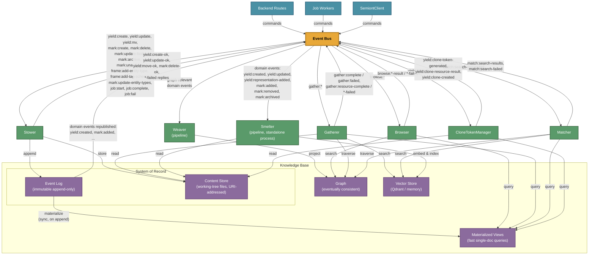

# Architecture

`@semiont/make-meaning` implements the actor model from [ACTOR-MODEL.md](../../../docs/system/ACTOR-MODEL.md).

## Actor Model

The package owns the **Knowledge Base** and the seven actors that serve it, in two categories: five **access actors** (Stower, Browser, Gatherer, Matcher, CloneTokenManager) mediate every read and write, and two **projection pipelines** (Weaver, Smelter) follow the event log to keep the eventually-consistent read models (graph, vectors) in sync. All communication flows through the **EventBus** — actors subscribe via RxJS pipelines and expose no public business methods: `initialize()` and `stop()`, plus a startup recovery entry point on the pipelines (`rebuildAll()` / `reconcile()`).

The third derived read model — the materialized views — is **not** pipeline-maintained: the EventStore's `ViewManager` materializes views synchronously inside `appendEvent()`, giving bus subscribers a read-your-writes guarantee.


```mermaid
graph TB
    Routes["Backend Routes"] -->|commands| BUS["Event Bus"]
    Workers["Job Workers"] -->|commands| BUS
    EBC["SemiontClient"] -->|commands| BUS

    BUS -->|"yield:create, yield:update, yield:mv,<br/>mark:create, mark:delete, mark:update-body,<br/>mark:archive, mark:unarchive,<br/>frame:add-entity-type, frame:add-tag-schema,<br/>mark:update-entity-types,<br/>job:start, job:complete, job:fail"| STOWER["Stower"]
    BUS -->|"browse:*"| BROWSER["Browser"]
    BUS -->|"gather:*"| GATHERER["Gatherer"]
    BUS -->|"match:search-requested"| MATCHER["Matcher"]
    BUS -->|"domain events:<br/>yield:created, yield:updated,<br/>yield:representation-added,<br/>mark:added, mark:removed, mark:archived"| SMELTER["Smelter<br/>(pipeline, standalone process)"]
    BUS -->|"graph-relevant<br/>domain events"| WEAVER["Weaver<br/>(pipeline)"]
    BUS -->|"yield:clone-*"| CTM["CloneTokenManager"]

    STOWER -->|append| EVENTLOG
    STOWER -->|store| CONTENT

    subgraph kb ["Knowledge Base"]
        subgraph sor ["System of Record"]
            EVENTLOG["Event Log<br/>(immutable append-only)"]
            CONTENT["Content Store<br/>(working-tree files, URI-addressed)"]
        end
        VIEWS["Materialized Views<br/>(fast single-doc queries)"]
        GRAPH["Graph<br/>(eventually consistent)"]
        VECTORS["Vector Store<br/>(Qdrant / memory)"]

        EVENTLOG -->|"materialize<br/>(sync, on append)"| VIEWS
    end

    WEAVER -->|project| GRAPH

    BROWSER -->|query| VIEWS
    BROWSER -->|search| GRAPH

    GATHERER -->|query| VIEWS
    GATHERER -->|read| CONTENT
    GATHERER -->|traverse| GRAPH
    GATHERER -->|search| VECTORS

    MATCHER -->|query| VIEWS
    MATCHER -->|traverse| GRAPH
    MATCHER -->|search| VECTORS

    SMELTER -->|read| CONTENT
    SMELTER -->|embed & index| VECTORS

    CTM -->|query| VIEWS
    CTM -->|read| CONTENT

    STOWER -->|"yield:create-ok, yield:update-ok,<br/>yield:move-ok, mark:delete-ok,<br/>*-failed replies"| BUS
    EVENTLOG -->|"domain events republished:<br/>yield:created, mark:added, ..."| BUS
    BROWSER -->|"browse:*-result / *-failed"| BUS
    GATHERER -->|"gather:complete / gather:failed,<br/>gather:resource-complete / *-failed"| BUS
    MATCHER -->|"match:search-results,<br/>match:search-failed"| BUS
    CTM -->|"yield:clone-token-generated,<br/>yield:clone-resource-result,<br/>yield:clone-created"| BUS

    classDef bus fill:#e8a838,stroke:#b07818,stroke-width:3px,color:#000,font-weight:bold
    classDef store fill:#8b6b9d,stroke:#6b4a7a,stroke-width:2px,color:#fff
    classDef worker fill:#5a9a6a,stroke:#3d6644,stroke-width:2px,color:#fff
    classDef caller fill:#4a90a4,stroke:#2c5f7a,stroke-width:2px,color:#fff

    class BUS bus
    class EVENTLOG,VIEWS,CONTENT,GRAPH,VECTORS store
    class STOWER,BROWSER,GATHERER,MATCHER,SMELTER,WEAVER,CTM worker
    class Routes,Workers,EBC caller
```

## Actors

### Stower (Write Gateway)

**Implementation**: [src/stower.ts](../src/stower.ts)

The single write path to the Knowledge Base event log — no other code calls `eventStore.appendEvent()`. Working-tree content is handled via `kb.content` (a `WorkingTreeStore`): the Stower registers, moves, and removes files in response to commands, while upload paths write bytes with `kb.content.store()` before emitting `yield:create`.

**Subscriptions** (EventBus commands → domain events). Success is usually signalled by the domain event itself, which the EventStore republishes onto the bus; the explicit reply channels are listed where they exist:

| Command | Domain Event | Reply Event |
|---------|-------------|-------------|
| `yield:create` | `yield:created` (content registered in content store) | `yield:create-ok` / `yield:create-failed` |
| `yield:update` | `yield:updated` | `yield:update-ok` / `yield:update-failed` |
| `yield:mv` | `yield:moved` | `yield:move-ok` / `yield:move-failed` |
| `mark:create` | `mark:added` | `mark:create-failed` on error |
| `mark:delete` | `mark:removed` | `mark:delete-ok` / `mark:delete-failed` |
| `mark:update-body` | `mark:body-updated` | `mark:body-update-failed` on error |
| `mark:archive` | `mark:archived` | — |
| `mark:unarchive` | `mark:unarchived` | — |
| `frame:add-entity-type` | `frame:entity-type-added` | `frame:entity-type-add-failed` on error |
| `frame:add-tag-schema` | `frame:tag-schema-added` | `frame:tag-schema-add-failed` on error |
| `mark:update-entity-types` | `mark:entity-tag-added` / `mark:entity-tag-removed` | — |
| `job:start` | `job:started` | — |
| `job:complete` | `job:completed` | — |
| `job:fail` | `job:failed` | — |

`job:report-progress` is ephemeral UI feedback — the Stower does not subscribe to it and nothing is persisted.

### Browser (Read Actor)

**Implementation**: [src/browser.ts](../src/browser.ts)

The read actor for the Knowledge Base. Handles deterministic, fact-based queries against the materialized state — single-source, single-ordering, no scoring, no fusion, no LLM. If a question can be answered by one query against one index (a view scan, a graph match, an event filter), the Browser handles it.

**Pipeline**: `browse:*` events use `mergeMap` for independent request-response (no grouping needed since they use `correlationId`).

| Request Event | Handler | Result Event |
|--------------|---------|-------------|
| `browse:resource-requested` | `assembleResourceGraph()` — materializes the resource from the event store and filters its inbound entity references (shared with `LocalContentTransport.getResourceGraph`) | `browse:resource-result` / `browse:resource-failed` |
| `browse:resources-requested` | `ResourceContext.listResources()` (delegates to `kb.graph.searchResources` when `search` is set) | `browse:resources-result` / `browse:resources-failed` |
| `browse:annotations-requested` | `AnnotationContext.getAllAnnotations()` | `browse:annotations-result` / `browse:annotations-failed` |
| `browse:annotation-requested` | `AnnotationContext.getAnnotation()` + `ResourceContext.getResourceMetadata()` | `browse:annotation-result` / `browse:annotation-failed` |
| `browse:events-requested` | `EventQuery.queryEvents()` | `browse:events-result` / `browse:events-failed` |
| `browse:annotation-history-requested` | `EventQuery` + annotation event filtering | `browse:annotation-history-result` / `browse:annotation-history-failed` |
| `browse:referenced-by-requested` | Graph referenced-by lookup + resource metadata | `browse:referenced-by-result` / `browse:referenced-by-failed` |
| `browse:entity-types-requested` | `readEntityTypesProjection()` | `browse:entity-types-result` / `browse:entity-types-failed` |
| `browse:tag-schemas-requested` | Tag-schema projection read | `browse:tag-schemas-result` / `browse:tag-schemas-failed` |
| `browse:agents-requested` | `deriveAgentRoster()` — the KB's declared software agents from the workers/actors inference config (COLLABORATOR-DIRECTORY) | `browse:agents-result` / `browse:agents-failed` |
| `browse:directory-requested` | Filesystem directory listing merged with KB metadata | `browse:directory-result` / `browse:directory-failed` |

#### Browse vs Match — when search belongs here vs in the Matcher

Both actors can find resources by name; the question is what kind of question is being asked.

- **Browse handles a query.** One signal, one ordering, deterministic. "Resources whose names contain X, sorted by date." `kb.graph.searchResources(query)` is a Browse primitive when used standalone — it answers the literal question and returns. The discover page's search box uses this path: a name match is exactly what the user asked for, nothing more.

- **Match handles a recommendation.** Multiple candidate sources, composite scoring against `GatheredContext`, optional LLM blending. "Given this annotation, this passage, and this graph neighborhood, what are the most relevant resources to bind?" That's not a query — it's a ranked judgment.

The same primitive (`kb.graph.searchResources`) is used by both actors today. That's fine: the difference is what each actor *does with the result*. Browse returns it sorted by date. Match treats it as one of four candidate sources and runs it through structural + semantic scoring.

The rule: **if the answer could be a single SQL/Cypher query against a single index, it's Browse. If it needs to fuse multiple sources or score against context, it's Match.** When discover-page search eventually wants fuzzy / semantic / context-boosted recall, that's the moment to route it through the Matcher instead of the Browser — and the http-transport surface would shift from `browse.resources({ search })` to `match.search(...)` accordingly.

### Gatherer (Context Assembly Actor)

**Implementation**: [src/gatherer.ts](../src/gatherer.ts)

Assembles `GatheredContext` for downstream actors (Matcher, generation workers). Pulls together passage context, graph neighborhood, vector semantic recall, and optionally an LLM-generated relationship summary into a single rich context object that other actors score against.

**Pipeline**: `gather:*` events use `groupBy(resourceId)` + `concatMap` for per-resource isolation and ordering.

| Request Event | Handler | Result Event |
|--------------|---------|-------------|
| `gather:requested` | `AnnotationContext.buildLLMContext(kb, inferenceClient)` — passage + graph + vector semantic search + optional inference summary | `gather:complete` / `gather:failed` |
| `gather:resource-requested` | `LLMContext.getResourceContext(kb)` | `gather:resource-complete` / `gather:resource-failed` |

### Matcher (Search/Link Actor)

**Implementation**: [src/matcher.ts](../src/matcher.ts)

Searches KB stores to resolve entity references and discover relationships. `match:search-requested` carries a `context` field (a `GatheredContext`); the Matcher runs context-driven search with multi-source candidate retrieval, composite structural scoring, and optional LLM-based semantic scoring.

| Request Event | Handler | Result Event |
|--------------|---------|-------------|
| `match:search-requested` | Context-driven search over four candidate sources | `match:search-results` / `match:search-failed` |

Referenced-by lookups are a deterministic single-index query and live on the Browser (`browse:referenced-by-requested`), not the Matcher.

**Context-driven search** retrieves candidates from four sources (name match, entity type filter, graph neighborhood, vector semantic search), scores them with structural signals (entity type overlap, bidirectionality, citation weight, name match, recency, vector similarity weighted at 25), and optionally blends LLM semantic relevance scores when an `InferenceClient` is available.

### CloneTokenManager (Clone Token Actor)

**Implementation**: [src/clone-token-manager.ts](../src/clone-token-manager.ts)

Manages the lifecycle of temporary clone tokens for resource cloning. In-memory token store with 15-minute expiry.

| Request Event | Handler | Result Event |
|--------------|---------|-------------|
| `yield:clone-token-requested` | Validate resource + content, generate token | `yield:clone-token-generated` / `yield:clone-token-failed` |
| `yield:clone-resource-requested` | Validate token, look up source resource | `yield:clone-resource-result` / `yield:clone-resource-failed` |
| `yield:clone-create` | Validate token, create resource via `ResourceOperations` | `yield:clone-created` / `yield:clone-create-failed` |

### Weaver (Projection Pipeline)

**Implementation**: [src/weaver.ts](../src/weaver.ts)

The `Weaver` subscribes to all domain events and projects graph-relevant events into the graph database. It uses an RxJS pipeline with adaptive burst buffering:

```
EventBus (callback, fire-and-forget)
  → Pre-filter: 9 graph-relevant event types
    → Subject<StoredEvent> (callback-to-RxJS bridge)
      → groupBy(resourceId)        — one stream per resource
        → burstBuffer(50ms, 500, 200ms) — adaptive batching per resource
          → concatMap               — sequential per resource
            → Single event: applyEventToGraph()
            → Batch: processBatch() → batchCreateResources / createAnnotations
```

It is carried on the `KnowledgeBase` record (`kb.weaver`) — `createKnowledgeBase()` constructs and starts it, and calls `rebuildAll()` at startup to replay the event log, so a wiped graph volume is recoverable.

### Smelter (Projection Pipeline, standalone process)

**Implementation**: [src/smelter.ts](../src/smelter.ts), entry point [src/smelter-main.ts](../src/smelter-main.ts)

The Smelter is **not started by `startMakeMeaning()`** — it runs as its own process via `@semiont/make-meaning/smelter-main`, receiving domain events through the [`SmelterActorStateUnit`](../src/smelter-actor-state-unit.ts) fan-in. It reads content from the KB working tree via `WorkerContentTransport` (metadata over the bus, bytes straight off disk), chunks it, computes embeddings via `@semiont/vectors` (Voyage or Ollama), and indexes vectors into the VectorStore (Qdrant or memory). Like the Weaver, it processes strictly in order per resource (`groupBy(resourceId)` + `concatMap`) with `burstBuffer` batching — consecutive same-type runs within a burst share a single `embedBatch()` call.

| Domain Event | Handler |
|--------------|---------|
| `yield:created` / `yield:updated` / `yield:representation-added` | Chunk resource text, embed, index into VectorStore |
| `mark:added` | Chunk annotation text, embed, index into VectorStore |
| `mark:removed` / `mark:archived` | Remove vectors from index |

Because Qdrant is an ephemeral projection of the event log, `Smelter.reconcile()` runs at startup. It is a *planner*: it diffs the index against the live catalog — membership (missing ids, orphans) and freshness (every upsert is stamped with the checksum of the bytes actually embedded; a mismatch against the catalog's claim means stale vectors) — and enqueues typed `smelt:*` work items through the same per-resource mailbox as live events, so reconcile and live traffic never race on a resource. A wiped Qdrant volume, or events missed while the worker was down, recover by restarting the smelter.

## Knowledge Base

The Knowledge Base is not an intelligent actor. It has no goals, preferences, or decisions. It is inert storage — the durable record of what intelligent actors decide.

**Implementation**: [src/knowledge-base.ts](../src/knowledge-base.ts)

```typescript
export interface KnowledgeBase {
  eventStore:     EventStore;       // Event Log (immutable append-only)
  views:          ViewStorage;      // Materialized Views (fast reads)
  content:        WorkingTreeStore; // Content Store (working-tree files, URI-addressed)
  graph:          GraphDatabase;    // Graph (eventually consistent)
  weaver:  Weaver;  // Event-to-graph projection pipeline
  vectors?:       VectorStore;      // Vector index (Qdrant / memory) — optional
  projectionsDir: string;
}
```

The `createKnowledgeBase(eventStore, project, graphDb, eventBus, logger, options?)` factory instantiates `FilesystemViewStorage` and `WorkingTreeStore` once, starts the `Weaver`, and (unless `options.skipRebuild`) rebuilds the materialized views and graph from the event log. Context modules receive `KnowledgeBase` instead of instantiating stores per call.

## Operations

`ResourceOperations` and `AnnotationOperations` are thin facades that emit commands on the EventBus. They do not access KB stores directly — the Stower handles persistence.

```
ResourceOperations.createResource()
  → eventBus.get('yield:create').next(...)
    → Stower subscribes, persists, emits yield:created
      → caller awaits yield:created via firstValueFrom
```

## Worker Architecture

Workers live in `@semiont/jobs`, not in this package. They run as a separate process, subscribe to the bus `job:queued` channel over SSE, and claim jobs via the `job:claim` request/response protocol — there is no polling loop. Workers are **not** actors — they claim and process jobs rather than subscribing to a reducer.

Workers emit `mark:create` and the job lifecycle events (`job:start`, `job:report-progress`, `job:complete`, `job:fail`) on the bus via their session's transport. The Stower handles all persistence.

See [Job Workers](./job-workers.md) for details.

## Initialization Order

`startMakeMeaning()` initializes components in dependency order:

1. JobQueue (with the inline `job:status-requested` subscription)
2. GraphDatabase
3. EventStore (with EventBus integration)
4. VectorStore + EmbeddingProvider *(optional — Qdrant or memory, from `@semiont/vectors`)*
5. **KnowledgeBase** (groups stores including optional vectors; starts Weaver; rebuilds views + graph unless `skipRebuild`)
6. **Stower** (must start before reader actors — it handles writes they depend on)
7. Entity type bootstrap (emits via EventBus, Stower persists)
8. **Gatherer** (context assembly, vector semantic search; gets its own InferenceClient)
9. **Matcher** (candidate search, vector semantic search, composite scoring; gets its own InferenceClient)
10. **Browser** (browse reads, entity type and tag-schema listing, directory browse)
11. **CloneTokenManager** (clone token lifecycle)
12. Bus command handlers (`registerBusHandlers` — request-channel translators)

Not started here: the **Smelter** (standalone process via `@semiont/make-meaning/smelter-main`) and the **job workers** (worker process in `@semiont/jobs`).

## Storage Architecture

All paths are resolved through `SemiontProject` (from `@semiont/core/node`) using XDG base directories. `project.stateDir` resolves to `$XDG_STATE_HOME/semiont/{project}/` (default: `~/.local/state/semiont/{project}/`).

### Event Store

Append-only log of domain events — the system of record, committed to version control:

```
.semiont/events/{shard}/{resourceId}/events-{seq}.jsonl
```

### View Storage

Projections of current state rebuilt from events:

```
{stateDir}/views/{shard}/{resourceId}.json
```

### Job Queue

Filesystem-based with atomic state transitions via file moves:

```
{stateDir}/jobs/{pending,running,complete,failed,cancelled}/{job-id}.json
```

Resources reference their content via `storageUri` (e.g. `file://README.md`). Semiont reads files where they live in the working tree.

## See Also

- [ACTOR-MODEL.md](../../../docs/system/ACTOR-MODEL.md) — System-wide actor model
- [API Reference](./api-reference.md) — Context modules and operations
- [Job Workers](./job-workers.md) — Worker implementations in @semiont/jobs
