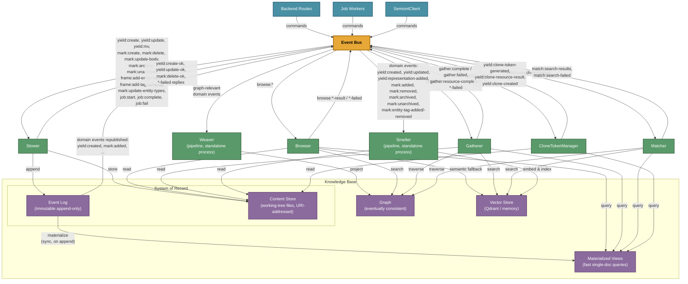

# Architecture

`@semiont/make-meaning` implements the actor model from [ACTOR-MODEL.md](../../../docs/system/ACTOR-MODEL.md).

## Actor Model

The package owns the **Knowledge Base** and the seven actors that serve it, in two categories: five **access actors** (Stower, Browser, Gatherer, Matcher, CloneTokenManager) mediate every read and write, and two **projection pipelines** (Weaver, Smelter) follow the event log to keep the eventually-consistent read models (graph, vectors) in sync. All communication flows through the **EventBus** — actors subscribe via RxJS pipelines and expose no public business methods: `initialize()` and `stop()`, plus a startup recovery entry point on the pipelines (`rebuildAll()` / `reconcile()`).

The third derived read model — the materialized views — is **not** pipeline-maintained: the EventStore's `ViewManager` materializes views synchronously inside `appendEvent()`, giving bus subscribers a read-your-writes guarantee.

### Deployment topology

The package has two composition roots and four standalone service entry points:

- **`startMakeMeaning()`** — the standalone root: runs all five access actors in-process against local stores.
- **`startMakeMeaningGateway()`** — the gateway root: starts **no actors**. It builds the KB reads for the backend's routes and handler subset, plus the job queue, reading views from the shared stateDir.
- **Archivist** (`archivist-main`) — the service that keeps the system of record: runs Stower, Browser and CloneTokenManager against local stores (event log, views, working tree, anchored text), plus the annotation-assembly handler, the entity-type bootstrap and the startup view rebuild. It serves no bytes — the gateway is the content server.
- **Librarian** (`librarian-main`) — the reference desk: runs the LLM-bound actors, Matcher and Gatherer, plus the gather-summary handler. It reads views from the shared stateDir the Archivist materializes into, bytes over `HttpContentTransport`, and runs the weave/smelt progress folds locally off the bus signals. It appends nothing, serves no bytes, and owns no store.
- **Weaver** (`weaver-main`) and **Smelter** (`smelter-main`) — the projection pipelines, each its own process in every arrangement.

Each actor's constructor takes a Pick-derived **capability slice** (`StowerStores`, `BrowserReads`, `GathererStores`, `MatcherStores`, `CloneTokenStores`) naming exactly the store operations it uses; a full `KnowledgeBase` satisfies every slice structurally. Each actor's inbound channel roster is exported beside it (`STOWER_CHANNELS`, `BROWSER_CHANNELS`, …) and pinned to its real subscriptions by a census gate in the decoupling tests.


```mermaid
graph TB
    Routes["Backend Routes"] -->|commands| BUS["Event Bus"]
    Workers["Job Workers"] -->|commands| BUS
    EBC["SemiontClient"] -->|commands| BUS

    BUS -->|"yield:create, yield:update, yield:mv,<br/>mark:create, mark:delete, mark:update-body,<br/>mark:archive, mark:unarchive,<br/>frame:add-entity-type, frame:add-tag-schema,<br/>mark:update-entity-types,<br/>job:start, job:complete, job:fail"| STOWER["Stower"]
    BUS -->|"browse:*"| BROWSER["Browser"]
    BUS -->|"gather:*"| GATHERER["Gatherer"]
    BUS -->|"match:search-requested"| MATCHER["Matcher"]
    BUS -->|"domain events:<br/>yield:created, yield:updated,<br/>yield:representation-added,<br/>mark:added, mark:removed,<br/>mark:archived, mark:unarchived,<br/>mark:entity-tag-added/-removed"| SMELTER["Smelter<br/>(pipeline, standalone process)"]
    BUS -->|"graph-relevant<br/>domain events"| WEAVER["Weaver<br/>(pipeline, standalone process)"]
    BUS -->|"yield:clone-*"| CTM["CloneTokenManager"]

    STOWER -->|append| EVENTLOG
    STOWER -->|store| CONTENT

    subgraph kb ["Knowledge Base"]
        subgraph sor ["System of Record"]
            EVENTLOG["Event Log<br/>(immutable append-only)"]
            CONTENT["Content Store<br/>(working-tree files, URI-addressed)"]
        end
        VIEWS["Materialized Views<br/>(fast single-doc queries)"]
        GRAPH["Graph<br/>(eventually consistent)"]
        VECTORS["Vector Store<br/>(Qdrant / memory)"]

        EVENTLOG -->|"materialize<br/>(sync, on append)"| VIEWS
    end

    WEAVER -->|project| GRAPH

    BROWSER -->|query| VIEWS
    BROWSER -->|search| GRAPH
    BROWSER -->|"semantic fallback"| VECTORS
    BROWSER -->|read| CONTENT

    GATHERER -->|query| VIEWS
    GATHERER -->|read| CONTENT
    GATHERER -->|traverse| GRAPH
    GATHERER -->|search| VECTORS

    MATCHER -->|query| VIEWS
    MATCHER -->|traverse| GRAPH
    MATCHER -->|search| VECTORS

    SMELTER -->|read| CONTENT
    SMELTER -->|embed & index| VECTORS

    CTM -->|query| VIEWS
    CTM -->|read| CONTENT

    STOWER -->|"yield:create-ok, yield:update-ok,<br/>mark:delete-ok,<br/>*-failed replies"| BUS
    EVENTLOG -->|"domain events republished:<br/>yield:created, mark:added, ..."| BUS
    BROWSER -->|"browse:*-result / *-failed"| BUS
    GATHERER -->|"gather:complete / gather:failed,<br/>gather:resource-complete / *-failed"| BUS
    MATCHER -->|"match:search-results,<br/>match:search-failed"| BUS
    CTM -->|"yield:clone-token-generated,<br/>yield:clone-resource-result,<br/>yield:clone-created"| BUS

    classDef bus fill:#e8a838,stroke:#b07818,stroke-width:3px,color:#000,font-weight:bold
    classDef store fill:#8b6b9d,stroke:#6b4a7a,stroke-width:2px,color:#fff
    classDef worker fill:#5a9a6a,stroke:#3d6644,stroke-width:2px,color:#fff
    classDef caller fill:#4a90a4,stroke:#2c5f7a,stroke-width:2px,color:#fff

    class BUS bus
    class EVENTLOG,VIEWS,CONTENT,GRAPH,VECTORS store
    class STOWER,BROWSER,GATHERER,MATCHER,SMELTER,WEAVER,CTM worker
    class Routes,Workers,EBC caller
```

## Actors

### Stower (Write Gateway)

**Implementation**: [src/stower.ts](../src/stower.ts)

The single write path to the Knowledge Base event log — no other code calls `eventStore.appendEvent()`. Runs in the Archivist service against its `StowerStores` slice (`content: ContentLifecycle`, `eventStore: EventAppends`). Working-tree content is handled through the lifecycle half of the `WorkingTreeStore`: the Stower registers, moves, and removes files in response to commands — never bytes; upload paths write bytes with `content.store()` before emitting `yield:create`.

**Subscriptions** (EventBus commands → domain events). Success is usually signalled by the domain event itself, which the EventStore republishes onto the bus; the explicit reply channels are listed where they exist:

| Command | Domain Event | Reply Event |
|---------|-------------|-------------|
| `yield:create` | `yield:created` (content registered in content store) | `yield:create-ok` / `yield:create-failed` |
| `yield:update` | `yield:updated` | `yield:update-ok` / `yield:update-failed` |
| `yield:mv` | `yield:moved` | `yield:move-failed` on error |
| `mark:create` | `mark:added` | `mark:create-failed` on error |
| `mark:delete` | `mark:removed` | `mark:delete-ok` / `mark:delete-failed` |
| `mark:update-body` | `mark:body-updated` | `mark:body-update-failed` on error |
| `mark:archive` | `mark:archived` | `mark:archive-failed` on error |
| `mark:unarchive` | `mark:unarchived` | `mark:unarchive-failed` on error |
| `frame:add-entity-type` | `frame:entity-type-added` | `frame:entity-type-add-failed` on error |
| `frame:add-tag-schema` | `frame:tag-schema-added` | `frame:tag-schema-add-failed` on error |
| `mark:update-entity-types` | `mark:entity-tag-added` / `mark:entity-tag-removed` | `mark:update-entity-types-failed` on error |
| `job:start` | `job:started` | — |
| `job:complete` | `job:completed` | — |
| `job:fail` | `job:failed` | — |

`job:report-progress` is ephemeral UI feedback — the Stower does not subscribe to it and nothing is persisted.

### Browser (Read Actor)

**Implementation**: [src/browser.ts](../src/browser.ts)

The read actor for the Knowledge Base. Handles deterministic, fact-based queries against the materialized state — single-source, single-ordering, no scoring, no fusion, no LLM. If a question can be answered by one query against one index (a view scan, a graph match, an event filter), the Browser handles it. Runs in the Archivist service against its `BrowserReads` slice — reads only: no `appendEvent`, no content bytes beyond `retrieve`.

**Pipeline**: `browse:*` events use `mergeMap` for independent request-response (no grouping needed since they use `correlationId`).

| Request Event | Handler | Result Event |
|--------------|---------|-------------|
| `browse:resource-requested` | `assembleResourceGraph()` — materializes the resource from the event store and filters its inbound entity references (shared with `LocalContentTransport.getResourceGraph`) | `browse:resource-result` / `browse:resource-failed` |
| `browse:anchored-text-requested` | `readAnchoredText()` — the anchored-text store's derived coordinate map | `browse:anchored-text-result` / `browse:anchored-text-failed` |
| `browse:resources-requested` | `ResourceContext.listResources()` (delegates to `kb.graph.listResources` when `search` is set, otherwise reads the materialized views) | `browse:resources-result` / `browse:resources-failed` |
| `browse:annotations-requested` | `AnnotationContext.getAllAnnotations()` | `browse:annotations-result` / `browse:annotations-failed` |
| `browse:annotation-requested` | `AnnotationContext.getAnnotation()` + `ResourceContext.getResourceMetadata()` | `browse:annotation-result` / `browse:annotation-failed` |
| `browse:events-requested` | `EventQuery.queryEvents()` | `browse:events-result` / `browse:events-failed` |
| `browse:annotation-history-requested` | `EventQuery` + annotation event filtering | `browse:annotation-history-result` / `browse:annotation-history-failed` |
| `browse:referenced-by-requested` | Graph referenced-by lookup + resource metadata | `browse:referenced-by-result` / `browse:referenced-by-failed` |
| `browse:entity-types-requested` | `readEntityTypesProjection()` | `browse:entity-types-result` / `browse:entity-types-failed` |
| `browse:tag-schemas-requested` | Tag-schema projection read | `browse:tag-schemas-result` / `browse:tag-schemas-failed` |
| `browse:agents-requested` | `deriveAgentRoster()` — the KB's declared software agents from the workers/actors inference config (COLLABORATOR-DIRECTORY) | `browse:agents-result` / `browse:agents-failed` |
| `browse:directory-requested` | Filesystem directory listing merged with KB metadata | `browse:directory-result` / `browse:directory-failed` |

#### Browse vs Match — when search belongs here vs in the Matcher

Both actors can find resources by name; the question is what kind of question is being asked.

- **Browse handles a query.** Lexical signals only, one deterministic ordering. "Resources where every term appears in the name, the path or an entity type, ranked by how directly the name answers and then by recency." `kb.graph.listResources({ search })` is a Browse primitive when used standalone — it answers the literal question and returns. The discover page's search box uses this path: a lexical match is exactly what the user asked for, nothing more.

- **Match handles a recommendation.** Multiple candidate sources, composite scoring against `GatheredContext`, optional LLM blending. "Given this annotation, this passage, and this graph neighborhood, what are the most relevant resources to bind?" That's not a query — it's a ranked judgment.

The same primitive (`kb.graph.listResources({ search })`) is used by both actors today. That's fine: the difference is what each actor *does with the result*. Browse returns it ranked and paged. Match treats it as one of four candidate sources and runs it through structural + semantic scoring.

The rule: **if the answer could be a single query against a single index, it's Browse. If it needs to fuse multiple sources or score against context, it's Match.** The boundary is *fusion*, not *modality*: the semantic fallback (SEMANTIC-FALLBACK — an empty lexical search answered from the vector index, labelled `matchKind: 'semantic'`) is one query against one index, fuses nothing, scores against no `GatheredContext`, and calls no LLM, so it lives in Browse and the transport surface stays `browse.resources({ search })`. What would genuinely move to the Matcher — and `match.search(...)` — is *blended* recall: fusing a lexical rank with a cosine score, or boosting either against context. That fusion is the Matcher's composite scorer's job, and it remains out of scope for Browse.

### Gatherer (Context Assembly Actor)

**Implementation**: [src/gatherer.ts](../src/gatherer.ts)

Assembles `GatheredContext` for downstream actors (Matcher, generation workers). Pulls together passage context, graph neighborhood, vector semantic recall, and optionally an LLM-generated relationship summary into a single rich context object that other actors score against. Runs in the Librarian service; its `GathererStores` slice reads content through the ResourceId-keyed `ContentReads` contract, so the standalone service fetches bytes over `HttpContentTransport` while in-process roots wrap their own working tree.

**Pipeline**: `gather:*` events use `groupBy(resourceId)` + `concatMap` for per-resource isolation and ordering.

| Request Event | Handler | Result Event |
|--------------|---------|-------------|
| `gather:requested` | `AnnotationContext.buildLLMContext(kb, inferenceClient)` — passage + graph + vector semantic search + optional inference summary | `gather:complete` / `gather:failed` |
| `gather:resource-requested` | `LLMContext.getResourceContext(kb)` | `gather:resource-complete` / `gather:resource-failed` |

### Matcher (Search/Link Actor)

**Implementation**: [src/matcher.ts](../src/matcher.ts)

Searches KB stores to resolve entity references and discover relationships. `match:search-requested` carries a `context` field (a `GatheredContext`); the Matcher runs context-driven search with multi-source candidate retrieval, composite structural scoring, and LLM-based semantic scoring. Runs in the Librarian service against its `MatcherStores` slice (`graph.listResources`/`getResource`, `views.get`, `vectors.searchResources`).

| Request Event | Handler | Result Event |
|--------------|---------|-------------|
| `match:search-requested` | Context-driven search over four candidate sources | `match:search-results` / `match:search-failed` |

Referenced-by lookups are a deterministic single-index query and live on the Browser (`browse:referenced-by-requested`), not the Matcher.

**Context-driven search** retrieves candidates from four sources (name match, entity type filter, graph neighborhood, vector semantic search), scores them with structural signals (entity type overlap, bidirectionality, citation weight, name match, recency, vector similarity weighted at 25), and blends LLM semantic relevance scores unless the request sets `useSemanticScoring: false`.

### CloneTokenManager (Clone Token Actor)

**Implementation**: [src/clone-token-manager.ts](../src/clone-token-manager.ts)

Manages the lifecycle of temporary clone tokens for resource cloning. In-memory token store with a short expiry — the **Implementation** link above is the literal. Runs in the Archivist service against its `CloneTokenStores` slice (`views.get`, `content.resolveUri` — no byte capability).

| Request Event | Handler | Result Event |
|--------------|---------|-------------|
| `yield:clone-token-requested` | Validate resource + content, generate token | `yield:clone-token-generated` / `yield:clone-token-failed` |
| `yield:clone-resource-requested` | Validate token, look up source resource | `yield:clone-resource-result` / `yield:clone-resource-failed` |
| `yield:clone-create` | Validate token, create resource via `ResourceOperations` | `yield:clone-created` / `yield:clone-create-failed` |

### Weaver (Projection Pipeline, standalone process)

**Implementation**: [src/weaver.ts](../src/weaver.ts), entry point [src/weaver-main.ts](../src/weaver-main.ts)

The Weaver is **not started by `startMakeMeaning()`** — it runs as its own process via `@semiont/make-meaning/weaver-main`, receiving graph-relevant domain events and `weave:rebuild` commands through the [`WeaverActorStateUnit`](../src/weaver-actor-state-unit.ts) fan-in (the graph projection is part of the graph stack, not the embedding process). It projects the nine graph-relevant event types into the graph database through an RxJS pipeline with adaptive burst buffering:

```
WeaverActorStateUnit.events$ (9 channels, StoredEvents)
  → Subject<StoredEvent>
    → groupBy(resourceId)        — one stream per resource
      → burstBuffer(50ms, 500, 200ms) — adaptive batching per resource
        → concatMap               — sequential per resource
          → Single event: applyEventToGraph()
          → Batch: processBatch() → batchCreateResources / createAnnotations
```

Every apply advances a per-resource high-water mark and emits a `weave:applied` signal; the backend's `WeaveProgress` fold (`kb.weaveProgress`) turns those into the `whenApplied` barrier the gatherer's graph reads use. At startup the Weaver runs a **checkpointed catch-up**: it discovers resources via `browse:resources-requested`, fetches gap events via `browse:events-requested` (its ONLY view of history — it has no event-store attachment), and replays them through the normal pipeline; a checkpoint ahead of the log (restore) triggers a per-resource rebuild. Full rebuilds are the `weave:rebuild` bus command — so a wiped graph volume recovers by command or by wiping the checkpoint and restarting.

### Smelter (Projection Pipeline, standalone process)

**Implementation**: [src/smelter.ts](../src/smelter.ts), entry point [src/smelter-main.ts](../src/smelter-main.ts)

The Smelter is **not started by `startMakeMeaning()`** — it runs as its own process via `@semiont/make-meaning/smelter-main`, receiving domain events through the [`SmelterActorStateUnit`](../src/smelter-actor-state-unit.ts) fan-in. It reads content bytes over `HttpContentTransport` (the gateway's byte path), chunks them, computes embeddings via `@semiont/vectors` (Voyage or Ollama), and indexes vectors into the VectorStore (Qdrant or memory). Like the Weaver, it processes strictly in order per resource (`groupBy(resourceId)` + `concatMap`) with `burstBuffer` batching — consecutive same-type runs within a burst share a single `embedBatch()` call. Every settled decision emits a `smelt:settled` signal; the backend's `SmeltProgress` fold (`kb.smeltProgress`) turns those into the `whenSettled` barrier the resource-gather path uses.

| Domain Event | Handler |
|--------------|---------|
| `yield:created` / `yield:updated` / `yield:representation-added` | Chunk resource text, embed, index into VectorStore |
| `mark:added` | Chunk annotation text, embed, index into VectorStore |
| `mark:removed` | Remove the annotation's vectors from the index |
| `mark:archived` / `mark:unarchived` | Remove / re-index the resource's vectors |
| `mark:entity-tag-added` / `mark:entity-tag-removed` | Re-stamp the entity types on the resource's vectors |

The `smelt:rebuild-anchors` command rides its own stream, never the per-resource event mailbox — a command handler plans work items and awaits their drain, so folding it into the lanes it drains into would deadlock.

Because Qdrant is an ephemeral projection of the event log, `Smelter.reconcile()` runs at startup. It is a *planner*: it diffs the index against the live catalog — membership (missing ids, orphans) and freshness (every upsert is stamped with the checksum of the bytes actually embedded; a mismatch against the catalog's claim means stale vectors) — and enqueues typed `smelt:*` work items through the same per-resource mailbox as live events, so reconcile and live traffic never race on a resource. A wiped Qdrant volume, or events missed while the worker was down, recover by restarting the smelter.

## Knowledge Base

The Knowledge Base is not an intelligent actor. It has no goals, preferences, or decisions. It is inert storage — the durable record of what intelligent actors decide.

**Implementation**: [src/knowledge-base.ts](../src/knowledge-base.ts)

```typescript
export interface KnowledgeBase {
  eventStore:     EventStore;        // Event Log (immutable append-only)
  views:          ViewStorage;       // Materialized Views (fast reads)
  content:        WorkingTreeStore;  // Content Store (working-tree files, URI-addressed)
  anchoredText:   AnchoredTextStore; // Derived coordinate maps for recovered text
  graph:          GraphDatabase;     // Graph (eventually consistent)
  weaveProgress:  WeaveProgress;     // weave:applied fold — the graph-projection barrier
  smeltProgress:  SmeltProgress;     // smelt:settled fold — the vector-projection barrier
  vectors:        VectorStore;       // Vector index (Qdrant / memory) — mandatory
  projectionsDir: string;
}
```

The `createKnowledgeBase(eventStore, project, graphDb, eventBus, logger, options)` factory instantiates `FilesystemViewStorage`, `WorkingTreeStore` and the anchored-text store once, constructs the `WeaveProgress` and `SmeltProgress` folds, and (unless `options.skipRebuild`) rebuilds the materialized views from the event log. `options.vectorStore` is required — a KB without vector search is not a supported configuration. The graph is NOT rebuilt here — the standalone Weaver catches up from its checkpoint. Actors and context modules receive Pick-derived slices of this interface, which a full `KnowledgeBase` satisfies structurally.

## Operations

`ResourceOperations` and `AnnotationOperations` are thin facades that emit commands on the EventBus. They do not access KB stores directly — the Stower handles persistence.

```
ResourceOperations.createResource()
  → eventBus.get('yield:create').next(...)
    → Stower subscribes, persists, emits yield:created
      → caller awaits yield:created via firstValueFrom
```

## Worker Architecture

Workers live in `@semiont/jobs`, not in this package. They run as a separate process, subscribe to the bus `job:queued` channel over SSE, and claim jobs via the `job:claim` request/response protocol — there is no polling loop. Workers are **not** actors — they claim and process jobs rather than subscribing to a reducer.

Workers emit `mark:create` and the job lifecycle events (`job:start`, `job:report-progress`, `job:complete`, `job:fail`) on the bus via their session's transport. The Stower handles all persistence.

See [Job Workers](./job-workers.md) for details.

## Initialization Order

`startMakeMeaning()` initializes components in dependency order:

1. JobQueue (with the inline `job:status-requested` subscription)
2. GraphDatabase
3. EventStore (with EventBus integration)
4. EmbeddingProvider + VectorStore *(mandatory — Qdrant or memory, from `@semiont/vectors`; each connect is bounded by the 60s startup timeout so the container restart policy can retry)*
5. **KnowledgeBase** (groups the stores; constructs the WeaveProgress and SmeltProgress folds; rebuilds views unless `skipRebuild` — the graph belongs to the standalone Weaver)
6. Event enrichment wiring (`wireEnrichment`)
7. **Stower** (must start before reader actors — it handles writes they depend on)
8. Entity type bootstrap (emits via EventBus, Stower persists)
9. **Gatherer** (context assembly, vector semantic search; gets its own InferenceClient and the `gather.settleTimeoutMs` barrier bound)
10. **Matcher** (candidate search, vector semantic search, composite scoring; gets its own InferenceClient)
11. **Browser** (browse reads, entity type and tag-schema listing, directory browse; gets the limits-discovery pool and the embedding provider)
12. **CloneTokenManager** (clone token lifecycle)
13. Bus command handlers (`registerBusHandlers` — request-channel translators)

Not started here: the **Weaver** and **Smelter** (standalone processes via `@semiont/make-meaning/weaver-main` / `smelter-main`) and the **job workers** (worker process in `@semiont/jobs`).

`startMakeMeaningGateway()` builds steps 1–5 only (and never rebuilds views — one rebuild owner, the Archivist), then registers the gateway's handler subset (`registerGatewayBusHandlers`): the annotation-assembly handler lives in the Archivist and the gather-summary handler in the Librarian, each beside the actor it calls.

## Storage Architecture

All paths are resolved through `SemiontProject` (from `@semiont/core/node`) using XDG base directories. `project.stateDir` resolves to `$XDG_STATE_HOME/semiont/{project}/` (default: `~/.local/state/semiont/{project}/`).

### Event Store

Append-only log of domain events — the system of record, committed to version control:

```
.semiont/events/{shard}/{resourceId}/events-{seq}.jsonl
```

### View Storage

Projections of current state rebuilt from events:

```
{stateDir}/views/{shard}/{resourceId}.json
```

### Job Queue

Filesystem-based with atomic state transitions via file moves:

```
{stateDir}/jobs/{pending,running,complete,failed,cancelled}/{job-id}.json
```

Resources reference their content via `storageUri` (e.g. `file://README.md`). Semiont reads files where they live in the working tree.

## See Also

- [ACTOR-MODEL.md](../../../docs/system/ACTOR-MODEL.md) — System-wide actor model
- [API Reference](./api-reference.md) — Context modules and operations
- [Job Workers](./job-workers.md) — Worker implementations in @semiont/jobs
