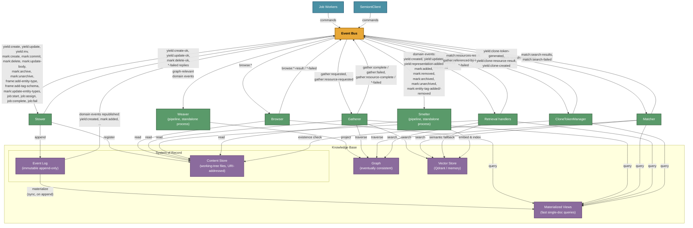

# Architecture

`@semiont/make-meaning` implements the actor model from [ACTOR-MODEL.md](../../../docs/architecture/ACTOR-MODEL.md).

## Actor Model

The package owns the **Knowledge Base** and the seven actors that serve it, in two categories: five **access actors** (Stower, Browser, Gatherer, Matcher, CloneTokenManager) mediate every read and write, and two **projection pipelines** (Weaver, Smelter) follow the event log to keep the eventually-consistent read models (graph, vectors) in sync. All communication flows through the **EventBus** — actors subscribe via RxJS pipelines and expose no public business methods: `initialize()` and `stop()`, plus a startup recovery entry point on the pipelines (`Weaver.catchUp()` / `Smelter.reconcile()`).

The third derived read model — the materialized views — is **not** pipeline-maintained: the EventStore's `ViewManager` materializes views synchronously inside `appendEvent()`, giving bus subscribers a read-your-writes guarantee.

### Deployment topology

The package has one composition root and four standalone service entry points:

- **`startMakeMeaning()`** — the standalone root: runs all five access actors in-process against local stores.
- **Archivist** (`archivist-main`) — the service that keeps the system of record: runs Stower, Browser and CloneTokenManager against local stores (event log, views, working tree, anchored text), plus the annotation-assembly, annotation-context and bind-update-body handlers, the entity-type bootstrap and the startup view rebuild. Its HTTP surface stores and serves the KB's bytes — the gateway proxies external content requests to it, and internal readers dial it directly.
- **Librarian** (`librarian-main`) — the reference desk: runs the LLM-bound actors, Matcher and Gatherer, plus the gather-summary handler and the two retrieval handlers, which answer text search (`match:resources-requested`) and what refers to a resource (`gather:referenced-by-requested`) from the graph and the vector index. It reads views from the shared stateDir the Archivist materializes into, bytes from the Archivist (`archivistContentReads` in `@semiont/content`), and runs the weave/smelt progress folds locally off the bus signals. It appends nothing, serves no bytes, and owns no store.
- **Weaver** (`weaver-main`) and **Smelter** (`smelter-main`) — the projection pipelines, each its own process in every arrangement.

Each actor's constructor takes a Pick-derived **capability slice** (`StowerStores`, `BrowserReads`, `GathererStores`, `MatcherStores`, `CloneTokenStores`) naming exactly the store operations it uses; a full `KnowledgeBase` satisfies every slice but `GathererStores` structurally (its `content` and `anchoredText` are a ResourceId-keyed byte read and a bus read, not the stores). Each actor's inbound channel roster is exported beside it (`STOWER_CHANNELS`, `BROWSER_CHANNELS`, …) and pinned to its real subscriptions by a census gate in the decoupling tests.


```mermaid
graph TB
    Workers["Job Workers"] -->|commands| BUS["Event Bus"]
    EBC["SemiontClient"] -->|commands| BUS

    BUS -->|"yield:create, yield:update, yield:mv,<br/>mark:create, mark:commit, mark:delete, mark:update-body,<br/>mark:archive, mark:unarchive,<br/>frame:add-entity-type, frame:add-tag-schema,<br/>mark:update-entity-types,<br/>job:start, job:assign, job:complete, job:fail"| STOWER["Stower"]
    BUS -->|"browse:*"| BROWSER["Browser"]
    BUS -->|"gather:requested,<br/>gather:resource-requested"| GATHERER["Gatherer"]
    BUS -->|"match:search-requested"| MATCHER["Matcher"]
    BUS -->|"match:resources-requested,<br/>gather:referenced-by-requested"| RETRIEVAL["Retrieval handlers"]
    BUS -->|"domain events:<br/>yield:created, yield:updated,<br/>yield:representation-added,<br/>mark:added, mark:removed,<br/>mark:archived, mark:unarchived,<br/>mark:entity-tag-added/-removed"| SMELTER["Smelter<br/>(pipeline, standalone process)"]
    BUS -->|"graph-relevant<br/>domain events"| WEAVER["Weaver<br/>(pipeline, standalone process)"]
    BUS -->|"yield:clone-*"| CTM["CloneTokenManager"]

    STOWER -->|append| EVENTLOG
    STOWER -->|register| CONTENT

    subgraph kb ["Knowledge Base"]
        subgraph sor ["System of Record"]
            EVENTLOG["Event Log<br/>(immutable append-only)"]
            CONTENT["Content Store<br/>(working-tree files, URI-addressed)"]
        end
        VIEWS["Materialized Views<br/>(fast single-doc queries)"]
        GRAPH["Graph<br/>(eventually consistent)"]
        VECTORS["Vector Store<br/>(Qdrant / memory)"]

        EVENTLOG -->|"materialize<br/>(sync, on append)"| VIEWS
    end

    WEAVER -->|project| GRAPH

    BROWSER -->|query| VIEWS
    BROWSER -->|read| CONTENT

    GATHERER -->|query| VIEWS
    GATHERER -->|read| CONTENT
    GATHERER -->|traverse| GRAPH
    GATHERER -->|search| VECTORS

    MATCHER -->|query| VIEWS
    MATCHER -->|traverse| GRAPH
    MATCHER -->|search| VECTORS

    RETRIEVAL -->|query| VIEWS
    RETRIEVAL -->|search| GRAPH
    RETRIEVAL -->|"semantic fallback"| VECTORS
    RETRIEVAL -->|read| CONTENT

    SMELTER -->|read| CONTENT
    SMELTER -->|embed & index| VECTORS

    CTM -->|query| VIEWS
    CTM -->|"existence check"| CONTENT

    STOWER -->|"yield:create-ok, yield:update-ok,<br/>mark:delete-ok,<br/>*-failed replies"| BUS
    EVENTLOG -->|"domain events republished:<br/>yield:created, mark:added, ..."| BUS
    BROWSER -->|"browse:*-result / *-failed"| BUS
    GATHERER -->|"gather:complete / gather:failed,<br/>gather:resource-complete / *-failed"| BUS
    MATCHER -->|"match:search-results,<br/>match:search-failed"| BUS
    RETRIEVAL -->|"match:resources-result,<br/>gather:referenced-by-result,<br/>*-failed"| BUS
    CTM -->|"yield:clone-token-generated,<br/>yield:clone-resource-result,<br/>yield:clone-created"| BUS

    classDef bus fill:#e8a838,stroke:#b07818,stroke-width:3px,color:#000,font-weight:bold
    classDef store fill:#8b6b9d,stroke:#6b4a7a,stroke-width:2px,color:#fff
    classDef worker fill:#5a9a6a,stroke:#3d6644,stroke-width:2px,color:#fff
    classDef caller fill:#4a90a4,stroke:#2c5f7a,stroke-width:2px,color:#fff

    class BUS bus
    class EVENTLOG,VIEWS,CONTENT,GRAPH,VECTORS store
    class STOWER,BROWSER,GATHERER,MATCHER,RETRIEVAL,SMELTER,WEAVER,CTM worker
    class Workers,EBC caller
```

## Actors

### Stower (Write Gateway)

**Implementation**: [src/stower.ts](../src/stower.ts)

The single write path to the Knowledge Base event log — no other code calls `eventStore.appendEvent()`. Runs in the Archivist service against its `StowerStores` slice (`content: ContentLifecycle`, `eventStore: EventAppends`). Working-tree content is handled through the lifecycle half of the `WorkingTreeStore`: the Stower registers, moves, and removes files in response to commands — never bytes; upload paths write bytes with `content.store()` before emitting `yield:create`.

**Subscriptions** (EventBus commands → domain events). Success is usually signalled by the domain event itself, which the EventStore republishes onto the bus; the explicit reply channels are listed where they exist:

| Command | Domain Event | Reply Event |
|---------|-------------|-------------|
| `yield:create` | `yield:created` (content registered in content store) | `yield:create-ok` / `yield:create-failed` |
| `yield:clone-persist` | `yield:cloned` (content registered in content store) | `yield:clone-persist-ok` / `yield:clone-persist-failed` |
| `yield:update` | `yield:updated` | `yield:update-ok` / `yield:update-failed` |
| `yield:mv` | `yield:moved` | `yield:move-failed` on error |
| `mark:create` | `mark:added` | `mark:create-failed` on error |
| `mark:commit` | `mark:added`, one per annotation the resource does not already hold | `mark:commit-ok` / `mark:commit-failed` |
| `mark:delete` | `mark:removed` | `mark:delete-ok` / `mark:delete-failed` |
| `mark:update-body` | `mark:body-updated` | `mark:body-update-failed` on error |
| `mark:archive` | `mark:archived` | `mark:archive-ok` / `mark:archive-failed` |
| `mark:unarchive` | `mark:unarchived` | `mark:unarchive-ok` / `mark:unarchive-failed` |
| `frame:add-entity-type` | `frame:entity-type-added` | `frame:entity-type-add-ok` / `frame:entity-type-add-failed` |
| `frame:add-tag-schema` | `frame:tag-schema-added` | `frame:tag-schema-add-ok` / `frame:tag-schema-add-failed` |
| `mark:update-entity-types` | `mark:entity-tag-added` / `mark:entity-tag-removed` | `mark:update-entity-types-ok` / `mark:update-entity-types-failed` |
| `person:profile` | `person:profiled`, when the name differs from the one recorded | — |
| `job:start` | `job:started` | — |
| `job:assign` | `job:assigned` | — |
| `job:complete` | `job:completed` | — |
| `job:fail` | `job:failed` | — |

`job:assign` is the dispatcher's, not a worker's: it emits one after accepting a `job:claim`, under its own service identity, recording which holder took which job and who requested it. The Stower persists it on the job's resource so a later write citing that job can be checked — holder against the writer, `creator` from the requester — by reading that resource's log alone.

`job:report-progress` is ephemeral UI feedback — the Stower does not subscribe to it and nothing is persisted.

#### Who a write is attributed to

A write says nothing about who made it. The Stower derives an annotation's or a resource's `creator`, `generator` and `wasAttributedTo` from two identities the gateway verified, and `attribution()` in `@semiont/core` is the one place those fields are built (`lint:attribution` fails the build if a second appears):

- **`creator`** is whoever asked for the work. For a write that cites no job, that is the writer. For one that cites a `jobId`, it is the DID that emitted the `job:create`, as the dispatcher recorded it on `job:assigned`. A payload that names a `creator` is refused.
- **`generator`** is the writer, when the writer is software. A worker may send one to carry the model's parameters, but its identity has to be the writer's own. One that names anyone else is refused, and one left out is filled in from the writer.
- **`wasAttributedTo`** is both, requester first, or one when they are the same agent.

To check a write that cites a job, the Stower reads the `job:assigned` record for that job on the resource's own log. A job with no assignment there is refused, and so is a write by anyone but the job's recorded holder. A writer with the worker role that cites no job is refused too, on `mark:commit` and on `yield:create`: "no job, so self-initiated" is true of a person and of an autonomous agent, and a silent lie for a worker that forgot the field.

### Browser (Read Actor)

**Implementation**: [src/browser.ts](../src/browser.ts)

The read actor for the record. It answers from the event log, the materialized views and the working tree — no graph, no vector index, no embedding, no LLM. If a question can be answered by a view read, an event filter or a directory listing, the Browser handles it. Runs in the Archivist service against its `BrowserReads` slice — reads only: no `appendEvent`, no content bytes beyond `retrieve`.

**Pipeline**: `browse:*` events use `mergeMap` for independent request-response (no grouping needed since they use `correlationId`).

| Request Event | Handler | Result Event |
|--------------|---------|-------------|
| `browse:resource-requested` | `assembleResourceGraph()` — materializes the resource from the event store and filters its inbound entity references (shared with `LocalContentTransport.getResourceGraph`) | `browse:resource-result` / `browse:resource-failed` |
| `browse:anchored-text-requested` | `readAnchoredText()` — the anchored-text store's derived coordinate map | `browse:anchored-text-result` / `browse:anchored-text-failed` |
| `browse:resources-requested` | `ResourceContext.listResources()` — the listing, filtered by `archived` and `entityType`, read from the materialized views | `browse:resources-result` / `browse:resources-failed` |
| `browse:annotations-requested` | `AnnotationContext.getAllAnnotations()` | `browse:annotations-result` / `browse:annotations-failed` |
| `browse:annotation-requested` | `AnnotationContext.getAnnotation()` + `ResourceContext.getResourceMetadata()` | `browse:annotation-result` / `browse:annotation-failed` |
| `browse:events-requested` | `EventQuery.queryEvents()`; each event with the agent its `userId` identifies, a Person named from `people.json` | `browse:events-result` / `browse:events-failed` |
| `browse:annotation-history-requested` | `EventQuery`, kept to the events `getAnnotationIdFromEvent` reads as this annotation's; attributed as `browse:events-requested` is | `browse:annotation-history-result` / `browse:annotation-history-failed` |
| `browse:entity-types-requested` | `readEntityTypesProjection()` | `browse:entity-types-result` / `browse:entity-types-failed` |
| `browse:tag-schemas-requested` | Tag-schema projection read | `browse:tag-schemas-result` / `browse:tag-schemas-failed` |
| `browse:agents-requested` | `deriveAgentRoster()` — the KB's declared software agents from the workers/actors inference config | `browse:agents-result` / `browse:agents-failed` |
| `browse:kb-requested` | `SemiontProject` — the committed `[project] name` and `[site] domain` — and, for a knowledge base that syncs git, the working tree's branch from the staging driver, read at each request | `browse:kb-result` / `browse:kb-failed` |
| `browse:directory-requested` | Filesystem directory listing merged with KB metadata | `browse:directory-result` / `browse:directory-failed` |

#### Browse vs Match and Gather — record or retrieval

**Browse answers from the record**: the event log, the materialized views, the working tree. **Anything that needs the graph, the vector index or an embedding is retrieval**, answered in the Librarian under Match or Gather.

- **A listing is Browse.** `browse:resources-requested` filters the views by `archived` and `entityType` and pages them by recency. The views are materialized on append, so a listing is read-your-writes.
- **A search by text is Match.** `match:resources-requested` asks "resources where every term appears in the name, the path or an entity type, ranked by how directly the name answers and then by recency" of the graph's lexical index, and asks the vector index when nothing matches. Each is one query against one index: it fuses nothing, scores against no `GatheredContext`, and calls no LLM.
- **What refers to a resource is Gather.** `gather:referenced-by-requested` is an inbound-edge query on the graph.
- **A recommendation is Match.** `match:search-requested` asks "given this annotation, this passage, and this graph neighborhood, what are the most relevant resources to bind?" Multiple candidate sources, composite scoring against `GatheredContext`, optional LLM blending. That's not a query — it's a ranked judgment, and the Matcher's.

The same primitive (`kb.graph.listResources({ search })`) serves both Match operations. The text search returns it ranked and paged. The Matcher treats it as one of four candidate sources and runs it through structural + semantic scoring.

### Gatherer (Context Assembly Actor)

**Implementation**: [src/gatherer.ts](../src/gatherer.ts)

Assembles `GatheredContext` for downstream actors (Matcher, generation workers). Pulls together passage context, graph neighborhood, vector semantic recall, and optionally an LLM-generated relationship summary into a single rich context object that other actors score against. Runs in the Librarian service; its `GathererStores` slice reads content through the ResourceId-keyed `ContentReads` contract, so the standalone service fetches bytes from the Archivist (`archivistContentReads`) while in-process roots wrap their own working tree.

**Pipeline**: `gather:*` events use `groupBy(resourceId)` + `concatMap` for per-resource isolation and ordering.

| Request Event | Handler | Result Event |
|--------------|---------|-------------|
| `gather:requested` | `AnnotationGather.buildLLMContext(kb, inferenceClient)` — passage + graph + vector semantic search + optional inference summary | `gather:complete` / `gather:failed` |
| `gather:resource-requested` | `LLMContext.getResourceContext(kb)` | `gather:resource-complete` / `gather:resource-failed` |

It also answers `gather:limits-requested` with the inference limits of its model (`gather:limits-result` / `gather:limits-failed`).

### Matcher (Search/Link Actor)

**Implementation**: [src/matcher.ts](../src/matcher.ts)

Searches KB stores to resolve entity references and discover relationships. `match:search-requested` carries a `context` field (a `GatheredContext`); the Matcher runs context-driven search with multi-source candidate retrieval, composite structural scoring, and LLM-based semantic scoring. Runs in the Librarian service against its `MatcherStores` slice (`graph.listResources`/`getResource`, `views.get`, `vectors.searchResources`).

| Request Event | Handler | Result Event |
|--------------|---------|-------------|
| `match:search-requested` | Context-driven search over four candidate sources | `match:search-results` / `match:search-failed` |

It also answers `match:limits-requested` with the inference limits of its model (`match:limits-result` / `match:limits-failed`).

**Context-driven search** retrieves candidates from four sources (name match, entity type filter, graph neighborhood, vector semantic search), scores them with structural signals (entity type overlap, bidirectionality, citation weight, name match, recency, vector similarity weighted at 25), and blends LLM semantic relevance scores unless the request sets `useSemanticScoring: false`.

### Retrieval handlers (text search, referenced-by)

**Implementation**: [src/handlers/resource-retrieval.ts](../src/handlers/resource-retrieval.ts)

The two reads that need the graph or the vector index and take no `GatheredContext`. They register beside the Matcher and the Gatherer, in the Librarian service and in the in-process root, and their channel roster is `RETRIEVAL_HANDLER_CHANNELS`. Each request is answered on its own (`mergeMap`).

| Request Event | Handler | Result Event |
|--------------|---------|-------------|
| `match:resources-requested` | `searchResources()` — the graph's lexical index; when its first page is empty, the vector index above `search.semanticFloor`, labelled `matchKind: 'semantic'` | `match:resources-result` / `match:resources-failed` |
| `gather:referenced-by-requested` | `findReferencedBy()` — the graph's inbound references, each with the name of the resource it is on | `gather:referenced-by-result` / `gather:referenced-by-failed` |

### CloneTokenManager (Clone Token Actor)

**Implementation**: [src/clone-token-manager.ts](../src/clone-token-manager.ts)

Manages the lifecycle of temporary clone tokens for resource cloning. In-memory token store with a short expiry — the **Implementation** link above is the literal. Runs in the Archivist service against its `CloneTokenStores` slice (`views.get`, `content.resolveUri` — no byte capability).

| Request Event | Handler | Result Event |
|--------------|---------|-------------|
| `yield:clone-token-requested` | Validate resource + content, generate token | `yield:clone-token-generated` / `yield:clone-token-failed` |
| `yield:clone-resource-requested` | Validate token, look up source resource | `yield:clone-resource-result` / `yield:clone-resource-failed` |
| `yield:clone-create` | Validate token, create resource via `ResourceOperations` | `yield:clone-created` / `yield:clone-create-failed` |

### Weaver (Projection Pipeline, standalone process)

**Implementation**: [src/weaver.ts](../src/weaver.ts), entry point [src/weaver-main.ts](../src/weaver-main.ts)

The Weaver is **not started by `startMakeMeaning()`** — it runs as its own process via `@semiont/make-meaning/weaver-main`, receiving graph-relevant domain events and `weave:rebuild` commands through the [`weaverFanIn`](../src/weaver-fan-in.ts) fan-in (the graph projection is part of the graph stack, not the embedding process). It projects the nine graph-relevant event types into the graph database through an RxJS pipeline with adaptive burst buffering:

```
weaverFanIn(bus).events$ (9 channels, StoredEvents)
  → Subject<StoredEvent>
    → groupBy(resourceId)        — one stream per resource
      → burstBuffer(50ms, 500, 200ms) — adaptive batching per resource
        → concatMap               — sequential per resource
          → Single event: applyEventToGraph()
          → Batch: processBatch() → batchCreateResources / createAnnotations
```

Every apply advances a per-resource high-water mark and emits a `weave:applied` signal; each graph-reading process keeps its own `WeaveProgress` fold (the Librarian's, or `kb.weaveProgress` in the in-process root), which turns those into the `whenApplied` barrier the gatherer's graph reads use. At startup the Weaver runs a **checkpointed catch-up**: it discovers resources via `browse:resources-requested`, fetches gap events via `browse:events-requested` (its ONLY view of history — it has no event-store attachment), and replays them through the normal pipeline; a checkpoint ahead of the log (restore) triggers a per-resource rebuild. Full rebuilds are the `weave:rebuild` bus command — so a wiped graph volume recovers by command or by wiping the checkpoint and restarting.

### Smelter (Projection Pipeline, standalone process)

**Implementation**: [src/smelter.ts](../src/smelter.ts), entry point [src/smelter-main.ts](../src/smelter-main.ts)

The Smelter is **not started by `startMakeMeaning()`** — it runs as its own process via `@semiont/make-meaning/smelter-main`, receiving domain events through the [`smelterFanIn`](../src/smelter-fan-in.ts) fan-in. It reads content bytes from the Archivist (`archivistContentReads` in `@semiont/content`), chunks them, computes embeddings via `@semiont/vectors` (Voyage or Ollama), and indexes vectors into the VectorStore (Qdrant or memory). Like the Weaver, it processes strictly in order per resource (`groupBy(resourceId)` + `concatMap`) with `burstBuffer` batching — consecutive same-type runs within a burst share a single `embedBatch()` call. Every settled decision emits a `smelt:settled` signal; each reading process keeps its own `SmeltProgress` fold (the Archivist's, the Librarian's, or `kb.smeltProgress` in the in-process root), which turns those into the `whenSettled` barrier the resource-gather and anchored-text reads use.

| Domain Event | Handler |
|--------------|---------|
| `yield:created` / `yield:updated` / `yield:representation-added` | Chunk resource text, embed, index into VectorStore |
| `mark:added` | Chunk annotation text, embed, index into VectorStore |
| `mark:removed` | Remove the annotation's vectors from the index |
| `mark:archived` / `mark:unarchived` | Remove / re-index the resource's vectors |
| `mark:entity-tag-added` / `mark:entity-tag-removed` | Re-stamp the entity types on the resource's vectors |

The `smelt:rebuild-anchors` command rides its own stream, never the per-resource event mailbox — a command handler plans work items and awaits their drain, so folding it into the lanes it drains into would deadlock.

Because Qdrant is an ephemeral projection of the event log, `Smelter.reconcile()` runs at startup. It is a *planner*: it diffs the index against the live catalog — membership (missing ids, orphans) and freshness (every upsert is stamped with the checksum of the bytes actually embedded; a mismatch against the catalog's claim means stale vectors) — and enqueues typed `smelt:*` work items through the same per-resource mailbox as live events, so reconcile and live traffic never race on a resource. A wiped Qdrant volume, or events missed while the worker was down, recover by restarting the smelter.

## Knowledge Base

The Knowledge Base is not an intelligent actor. It has no goals, preferences, or decisions. It is inert storage — the durable record of what intelligent actors decide.

**Implementation**: [src/knowledge-base.ts](../src/knowledge-base.ts)

| Member | What it is | From |
|---|---|---|
| `eventStore` | The event log: immutable, append-only, the record | [`@semiont/event-sourcing`](../../event-sourcing/README.md) |
| `views` | The materialized views, written inside each append | `@semiont/event-sourcing` |
| `content` | The working tree's files, by URI | [`@semiont/content`](../../content/README.md) |
| `anchoredText` | Text derived from files that carry none, with its geometry | `@semiont/content` |
| `graph` | The graph, eventually consistent | [`@semiont/graph`](../../graph/README.md) |
| `vectors` | The vector index. Required | [`@semiont/vectors`](../../vectors/README.md) |
| `weaveProgress` | The fold of `weave:applied`: the barrier a graph read waits at | here |
| `smeltProgress` | The fold of `smelt:settled`: the barrier a vector read waits at | here |
| `projectionsDir` | Where the system-wide projections are | |

The `createKnowledgeBase(eventStore, project, graphDb, eventBus, logger, options)` factory instantiates `FilesystemViewStorage`, `WorkingTreeStore` and the anchored-text store once, constructs the `WeaveProgress` and `SmeltProgress` folds, and (unless `options.skipRebuild`) rebuilds the materialized views from the event log. `options.vectorStore` is required — a KB without vector search is not a supported configuration. The graph is NOT rebuilt here — the standalone Weaver catches up from its checkpoint. Actors and context modules receive Pick-derived slices of this interface, which a full `KnowledgeBase` satisfies structurally — except the gather paths' slices, whose `content` and `anchoredText` in-process roots wrap around `kb`.

## Operations

`AnnotationOperations` (here) and `ResourceOperations` (in `@semiont/core`) are thin facades over the bus: `ResourceOperations` awaits its reply through `busRequest`, `AnnotationOperations` emits its command and returns. Neither writes KB stores — the Stower handles persistence.

| `AnnotationOperations` | |
|---|---|
| `createAnnotation` | Refuses a target whose media type cannot carry a coordinate, assembles the W3C annotation (body, target and `created`, no `creator`), emits `mark:create`, and returns what it assembled |
| `updateAnnotationBody` | Reads the annotation from the views, emits `mark:update-body`, and returns the annotation with the operations applied |
| `deleteAnnotation` | Checks that the resource's view holds the annotation, then emits `mark:delete` |

```
ResourceOperations.createResource(input, { did: userId, roles: [] }, bus)
  → busRequest(bus, 'yield:create', …)
    → Stower persists, replies yield:create-ok / yield:create-failed
      → matched on correlationId; resolves to the new ResourceId
```

## Context modules

The readers the actors and handlers are built from. Each takes the slice of the knowledge base it reads, so each can be called on its own.

| Function | Gives | Used by |
|---|---|---|
| `ResourceContext.getResourceMetadata` | A resource's descriptor from its view, or `null` | Browser, CloneTokenManager, both gather paths |
| `ResourceContext.listResources` | A page of the resources with `total`, the size of the whole listing, filtered by `archived` and `entityType` and read from the views | Browser |
| `searchResources` | A page of the resources a text finds, with `total`, the size of the whole match set, and `matchKind`. The graph's lexical index answers. When its first page is empty, the vector index answers, and `matchKind` is `'semantic'` | Retrieval handlers |
| `findReferencedBy` | The annotations elsewhere that refer to a resource, each with the name of the resource it is on, from the graph | Retrieval handlers |
| `ResourceContext.addContentPreviews` | The same resources, each with its content as text | Browser |
| `ResourceContext.getResourceContent` | A resource's text. The media type decides where it comes from: decoded from its bytes, asked of the anchored text for a PDF, or `undefined` for a type with none | Both gather paths |
| `AnnotationContext.getResourceAnnotations`, `getAllAnnotations`, `getAnnotation` | A resource's annotations from its view: the view with its version, the list alone, or one | Browser, `AnnotationOperations` |
| `AnnotationGather.buildLLMContext` | The `GatheredContext` for an annotation: the passage and what surrounds it, the resource, `semanticContext` from the vector index, the graph neighbourhood, and a summary of how the passage relates to it when an inference client is given | Gatherer |
| `LLMContext.getResourceContext` | The `GatheredContext` for a resource | Gatherer |
| `GraphContext.buildKnowledgeGraph` | A resource's neighbourhood as a `KnowledgeGraph`: resources and annotations as typed nodes, typed directed edges, inbound citations included | Both gather paths |

The two gather paths do not take the working tree. Their `content` is a read by `ResourceId` (`ContentReads`) and their `anchoredText` is a read over the bus, so that the Librarian, which mounts nothing, runs the same code as a process that holds the stores.

A gather waits for the projections it reads, within bounds. A graph read waits at `weaveProgress.whenApplied` for under a second. A resource gather waits at `smeltProgress.whenSettled` for up to `gather.settleTimeoutMs`. Past either bound the gather goes on without that part, and counts the degrade (`recordGatherDegrade`).

## Workers

Workers are not in this package and are not actors. They are [`@semiont/jobs`](../../jobs/README.md): a separate process that claims jobs from the dispatcher over the bus and commits what it produces with `mark:commit`, which the Stower answers once the annotations are in the log. [Workers](../../jobs/docs/Workers.md) describes the worker; [who a write is attributed to](#who-a-write-is-attributed-to) is the part this package decides.

## Initialization Order

`startMakeMeaning()` refuses a knowledge base whose committed `.semiont/config` declares no `[site] domain`: the knowledge base acts under that identity. It then initializes components in dependency order:

1. GraphDatabase
2. EventStore (with EventBus integration)
3. EmbeddingProvider + VectorStore *(mandatory — Qdrant or memory, from `@semiont/vectors`; each connect is bounded by the 60s startup timeout so the container restart policy can retry)*
4. **KnowledgeBase** (groups the stores; constructs the WeaveProgress and SmeltProgress folds; rebuilds views unless `skipRebuild` — the graph belongs to the standalone Weaver)
5. Event enrichment wiring (`wireEnrichment`)
6. **Stower** (must start before reader actors — it handles writes they depend on)
7. Entity type bootstrap (emits via EventBus as the knowledge base itself, `did:web:<[site] domain>`; Stower persists)
8. **Gatherer** (context assembly, vector semantic search; gets its own InferenceClient and the `gather.settleTimeoutMs` barrier bound)
9. **Matcher** (candidate search, vector semantic search, composite scoring; gets its own InferenceClient)
10. Retrieval handlers (`registerRetrievalHandlers` — text search and referenced-by; get the embedding provider and `search.semanticFloor`)
11. **Browser** (browse reads, entity type and tag-schema listing, directory browse; gets the role roster)
12. **CloneTokenManager** (clone token lifecycle)
13. Bus command handlers (`registerBusHandlers` — request-channel translators)

Not started here: the **Weaver** and **Smelter** (standalone processes via `@semiont/make-meaning/weaver-main` / `smelter-main`), the **job queue** (the dispatcher's) and the **job workers** (worker process in `@semiont/jobs`).

In the split deployment no root builds a subset: each service's `*-main` composes exactly what it owns, and the gateway composes nothing from this package — it verifies, validates and routes. The handlers sit beside the actors they call: annotation-assembly, annotation-context and bind-update-body in the Archivist, gather-summary and the two retrieval handlers in the Librarian; the `job:*` set is the dispatcher's, with the queue.

## Storage Architecture

All paths are resolved through `SemiontProject` (from `@semiont/core/node`) using XDG base directories. `project.stateDir` resolves to `$XDG_STATE_HOME/semiont/{project}/`; `XDG_STATE_HOME` has no default, and constructing a project without it throws.

The event log is committed with the knowledge base, under `.semiont/events/`. The views are under `stateDir` and can be rebuilt from it. [Storage layout](../../event-sourcing/docs/STORAGE-LAYOUT.md) has both trees. A resource's content is the file its `storageUri` names in the working tree (`file://README.md`), read where it lives: [`@semiont/content`](../../content/docs/architecture.md).

## Why the Stower and the Browser share a process

Stower writes the events and projections that Browser reads, so splitting them would open a cross-process read-after-write window over the same state. Git is single-writer for the same reason — the Archivist owns the working tree.

## EventBus ownership

The EventBus is created by the caller (a script or a test) and passed into `startMakeMeaning()` as a dependency. Make-meaning does not own or encapsulate the EventBus — the caller shares it with every actor in the process.

## Pure projection validators

Entity types are a controlled vocabulary: the Stower refuses a `mark:update-entity-types` that adds one not registered. The rule is a pure function in [`src/views/projection-validators.ts`](../src/views/projection-validators.ts): `validateEntityTypes(registered, requested)` → `{ ok: true } | { ok: false; unknown }`, a set membership check that lists the offending tags in caller order. The Stower is the I/O shell: it reads the projection (via the readers in `src/views/`), passes it to the validator, and refuses the whole request before its first append. Validator unit tests run in single-digit milliseconds with no filesystem and no event bus; `__tests__/stower-entity-types.test.ts` covers the wiring.

This pattern (functional core, imperative shell) is shared with `@semiont/event-sourcing`'s projection reducers; see [`docs/architecture/PROJECTION-PATTERN.md`](../../../docs/architecture/PROJECTION-PATTERN.md) for the architectural narrative, the full axiom catalog, and guidance for adding new validators.

## See Also

- [ACTOR-MODEL.md](../../../docs/architecture/ACTOR-MODEL.md) — System-wide actor model
- [Scripting](./SCRIPTING.md) — A knowledge base in your own process
- [Workers](../../jobs/docs/Workers.md) — The worker, in `@semiont/jobs`
