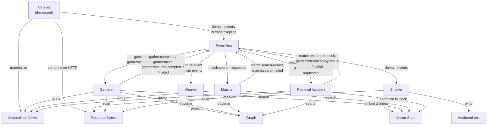

# Architecture

`@semiont/make-meaning` implements the Librarian, the Smelter and the Weaver of the actor model in [ACTOR-MODEL.md](../../../docs/architecture/ACTOR-MODEL.md).

## Actor Model

The package holds two **access actors** (Gatherer, Matcher), which answer retrieval, and two **projection pipelines** (Weaver, Smelter), which follow the record to keep the eventually-consistent read models (graph, vectors) in step. All communication flows through the **EventBus** — actors subscribe via RxJS pipelines and expose no public business methods: `initialize()` and `stop()`, plus a startup recovery entry point on the pipelines (`Weaver.catchUp()` / `Smelter.reconcile()`).

The record itself — the event log, the materialized views and the working tree — is the [Archivist](../../../docs/protocol/ARCHIVIST.md)'s. Its Stower is the only writer and its Browser answers `browse:*`. Nothing in this package appends an event or writes a view.

### Deployment topology

The package has three service entry points:

- **Librarian** (`librarian-main`) — the reference desk: runs the LLM-bound actors, Matcher and Gatherer, plus the gather-summary handler and the two retrieval handlers, which answer text search (`match:resources-requested`) and what refers to a resource (`gather:referenced-by-requested`) from the graph and the vector index. It reads views from the shared stateDir the Archivist materializes into, bytes from the Archivist (`archivistContentReads` in `@semiont/content`), and runs the weave/smelt progress folds locally off the bus signals. It appends nothing, serves no bytes, and owns no store.
- **Weaver** (`weaver-main`) and **Smelter** (`smelter-main`) — the projection pipelines, each its own process.

Each actor's constructor takes a Pick-derived **capability slice** (`GathererStores`, `MatcherStores`) naming exactly the store operations it uses. Each actor's inbound channel roster is exported from `service-channels.ts` (`GATHERER_CHANNELS`, `MATCHER_CHANNELS`, `RETRIEVAL_HANDLER_CHANNELS`) and pinned to its real subscriptions by a census gate in the decoupling tests.


```mermaid
graph TB
    BUS["Event Bus"]
    ARCHIVIST["Archivist<br/>(the record)"]

    BUS -->|"gather:requested,<br/>gather:resource-requested"| GATHERER["Gatherer"]
    BUS -->|"match:search-requested"| MATCHER["Matcher"]
    BUS -->|"match:resources-requested,<br/>gather:referenced-by-requested"| RETRIEVAL["Retrieval handlers"]
    BUS -->|"domain events"| SMELTER["Smelter"]
    BUS -->|"graph-relevant<br/>domain events"| WEAVER["Weaver"]

    ARCHIVIST -->|"domain events,<br/>browse:* replies"| BUS
    ARCHIVIST -->|materialize| VIEWS["Materialized Views"]
    ARCHIVIST -->|"content over HTTP"| CONTENT["Resource bytes"]

    WEAVER -->|project| GRAPH["Graph"]
    SMELTER -->|read| CONTENT
    SMELTER -->|"embed & index"| VECTORS["Vector Store"]
    SMELTER -->|write| ANCHORED["Anchored text"]

    GATHERER -->|query| VIEWS
    GATHERER -->|read| CONTENT
    GATHERER -->|traverse| GRAPH
    GATHERER -->|search| VECTORS

    MATCHER -->|query| VIEWS
    MATCHER -->|traverse| GRAPH
    MATCHER -->|search| VECTORS

    RETRIEVAL -->|query| VIEWS
    RETRIEVAL -->|search| GRAPH
    RETRIEVAL -->|"semantic fallback"| VECTORS
    RETRIEVAL -->|read| CONTENT

    GATHERER -->|"gather:complete / gather:failed,<br/>gather:resource-complete / *-failed"| BUS
    MATCHER -->|"match:search-results,<br/>match:search-failed"| BUS
    RETRIEVAL -->|"match:resources-result,<br/>gather:referenced-by-result,<br/>*-failed"| BUS
```

## Actors

#### Browse vs Match and Gather — record or retrieval

**Browse answers from the record**: the event log, the materialized views, the working tree. That is the Archivist's. **Anything that needs the graph, the vector index or an embedding is retrieval**, answered in the Librarian under Match or Gather.

- **A listing is Browse.** `browse:resources-requested` filters the views by `archived` and `entityType` and pages them by recency.
- **A search by text is Match.** `match:resources-requested` asks "resources where every term appears in the name, the path or an entity type, ranked by how directly the name answers and then by recency" of the graph's lexical index, and asks the vector index when nothing matches. Each is one query against one index: it fuses nothing, scores against no `GatheredContext`, and calls no LLM.
- **What refers to a resource is Gather.** `gather:referenced-by-requested` is an inbound-edge query on the graph.
- **A recommendation is Match.** `match:search-requested` asks "given this annotation, this passage, and this graph neighborhood, what are the most relevant resources to bind?" Multiple candidate sources, composite scoring against `GatheredContext`, optional LLM blending. That's not a query — it's a ranked judgment, and the Matcher's.

The same primitive (the graph's `listResources({ search })`) serves both Match operations. The text search returns it ranked and paged. The Matcher treats it as one of four candidate sources and runs it through structural + semantic scoring.

### Gatherer (Context Assembly Actor)

**Implementation**: [src/gatherer.ts](../src/gatherer.ts)

Assembles `GatheredContext` for downstream actors (Matcher, generation workers). Pulls together passage context, graph neighborhood, vector semantic recall, and optionally an LLM-generated relationship summary into a single rich context object that other actors score against. Runs in the Librarian service; its `GathererStores` slice reads content through the ResourceId-keyed `ContentReads` contract, so the service fetches bytes from the Archivist (`archivistContentReads`).

**Pipeline**: `gather:*` events use `groupBy(resourceId)` + `concatMap` for per-resource isolation and ordering.

| Request Event | Handler | Result Event |
|--------------|---------|-------------|
| `gather:requested` | `AnnotationGather.buildLLMContext(kb, inferenceClient)` — passage + graph + vector semantic search + optional inference summary | `gather:complete` / `gather:failed` |
| `gather:resource-requested` | `LLMContext.getResourceContext(kb)` | `gather:resource-complete` / `gather:resource-failed` |

It also answers `gather:limits-requested` with the inference limits of its model (`gather:limits-result` / `gather:limits-failed`).

### Matcher (Search/Link Actor)

**Implementation**: [src/matcher.ts](../src/matcher.ts)

Searches KB stores to resolve entity references and discover relationships. `match:search-requested` carries a `context` field (a `GatheredContext`); the Matcher runs context-driven search with multi-source candidate retrieval, composite structural scoring, and LLM-based semantic scoring. Runs in the Librarian service against its `MatcherStores` slice (`graph.listResources`/`getResource`, `views.get`, `vectors.searchResources`).

| Request Event | Handler | Result Event |
|--------------|---------|-------------|
| `match:search-requested` | Context-driven search over four candidate sources | `match:search-results` / `match:search-failed` |

It also answers `match:limits-requested` with the inference limits of its model (`match:limits-result` / `match:limits-failed`).

**Context-driven search** retrieves candidates from four sources (name match, entity type filter, graph neighborhood, vector semantic search), scores them with structural signals (entity type overlap, bidirectionality, citation weight, name match, recency, vector similarity weighted at 25), and blends LLM semantic relevance scores unless the request sets `useSemanticScoring: false`.

### Retrieval handlers (text search, referenced-by)

**Implementation**: [src/handlers/resource-retrieval.ts](../src/handlers/resource-retrieval.ts)

The two reads that need the graph or the vector index and take no `GatheredContext`. They register beside the Matcher and the Gatherer, in the Librarian, and their channel roster is `RETRIEVAL_HANDLER_CHANNELS`. Each request is answered on its own (`mergeMap`).

| Request Event | Handler | Result Event |
|--------------|---------|-------------|
| `match:resources-requested` | `searchResources()` — the graph's lexical index; when its first page is empty, the vector index above `search.semanticFloor`, labelled `matchKind: 'semantic'` | `match:resources-result` / `match:resources-failed` |
| `gather:referenced-by-requested` | `findReferencedBy()` — the graph's inbound references, each with the name of the resource it is on | `gather:referenced-by-result` / `gather:referenced-by-failed` |

### Weaver (Projection Pipeline, standalone process)

**Implementation**: [src/weaver.ts](../src/weaver.ts), entry point [src/weaver-main.ts](../src/weaver-main.ts)

The Weaver runs as its own process via `@semiont/make-meaning/weaver-main`, receiving graph-relevant domain events and `weave:rebuild` commands through the [`weaverFanIn`](../src/weaver-fan-in.ts) fan-in (the graph projection is part of the graph stack, not the embedding process). It projects the nine graph-relevant event types into the graph database through an RxJS pipeline with adaptive burst buffering:

```
weaverFanIn(bus).events$ (9 channels, StoredEvents)
  → Subject<StoredEvent>
    → groupBy(resourceId)        — one stream per resource
      → burstBuffer(50ms, 500, 200ms) — adaptive batching per resource
        → concatMap               — sequential per resource
          → Single event: applyEventToGraph()
          → Batch: processBatch() → batchCreateResources / createAnnotations
```

Every apply advances a per-resource high-water mark and emits a `weave:applied` signal; the Librarian keeps a `WeaveProgress` fold, which turns those into the `whenApplied` barrier the gatherer's graph reads use. At startup the Weaver runs a **checkpointed catch-up**: it discovers resources via `browse:resources-requested`, fetches gap events via `browse:events-requested` (its ONLY view of history), and replays them through the normal pipeline; a checkpoint ahead of the log (restore) triggers a per-resource rebuild. Full rebuilds are the `weave:rebuild` bus command — so a wiped graph volume recovers by command or by wiping the checkpoint and restarting.

### Smelter (Projection Pipeline, standalone process)

**Implementation**: [src/smelter.ts](../src/smelter.ts), entry point [src/smelter-main.ts](../src/smelter-main.ts)

The Smelter runs as its own process via `@semiont/make-meaning/smelter-main`, receiving domain events through the [`smelterFanIn`](../src/smelter-fan-in.ts) fan-in. It reads content bytes from the Archivist (`archivistContentReads` in `@semiont/content`), chunks them, computes embeddings via `@semiont/vectors` (Voyage or Ollama), and indexes vectors into the VectorStore (Qdrant or memory). Like the Weaver, it processes strictly in order per resource (`groupBy(resourceId)` + `concatMap`) with `burstBuffer` batching — consecutive same-type runs within a burst share a single `embedBatch()` call. Every settled decision emits a `smelt:settled` signal; each reading process keeps its own `SmeltProgress` fold, which turns those into the `whenSettled` barrier the resource-gather read uses.

| Domain Event | Handler |
|--------------|---------|
| `yield:created` / `yield:updated` / `yield:representation-added` | Chunk resource text, embed, index into VectorStore |
| `mark:added` | Chunk annotation text, embed, index into VectorStore |
| `mark:removed` | Remove the annotation's vectors from the index |
| `mark:archived` / `mark:unarchived` | Remove / re-index the resource's vectors |
| `mark:entity-tag-added` / `mark:entity-tag-removed` | Re-stamp the entity types on the resource's vectors |

The `smelt:rebuild-anchors` command rides its own stream, never the per-resource event mailbox — a command handler plans work items and awaits their drain, so folding it into the lanes it drains into would deadlock.

Because Qdrant is an ephemeral projection of the event log, `Smelter.reconcile()` runs at startup. It is a *planner*: it diffs the index against the live catalog — membership (missing ids, orphans) and freshness (every upsert is stamped with the checksum of the bytes actually embedded; a mismatch against the catalog's claim means stale vectors) — and enqueues typed `smelt:*` work items through the same per-resource mailbox as live events, so reconcile and live traffic never race on a resource. A wiped Qdrant volume, or events missed while the worker was down, recover by restarting the smelter.

## What each service reads and writes

| Store | What it is | This package |
|---|---|---|
| The views | A resource's descriptor and annotations, materialized by the Archivist | Librarian reads, through [`@semiont/event-sourcing`](../../event-sourcing/README.md) |
| The people projection | What each DID is called | Librarian reads (`views/people-reader.ts`) |
| Resource bytes | A resource's files | Librarian and Smelter read from the Archivist, through [`@semiont/content`](../../content/README.md) |
| Anchored text | Text derived from files that carry none, with its geometry | Smelter writes; the Librarian asks the Archivist over the bus |
| The graph | Eventually consistent | Weaver writes; Librarian reads ([`@semiont/graph`](../../graph/README.md)) |
| The vector index | Required | Smelter writes; Librarian reads ([`@semiont/vectors`](../../vectors/README.md)) |

Two folds stand between a reader and a store that is still catching up: `WeaveProgress`, of `weave:applied`, is the barrier a graph read waits at; `SmeltProgress`, of `smelt:settled`, is the barrier a vector read waits at.

## Context modules

The readers the actors and handlers are built from. Each takes the slice of the knowledge base it reads, so each can be called on its own.

| Function | Gives | Used by |
|---|---|---|
| `ResourceContext.getResourceMetadata` | A resource's descriptor from its view, or `null` | Both gather paths |
| `ResourceContext.getResourceContent` | A resource's text. The media type decides where it comes from: decoded from its bytes, asked of the anchored text for a PDF, or `undefined` for a type with none | Both gather paths |
| `AnnotationContext.getAnnotation`, `extractAnnotationContext` | One annotation from its resource's view, and the text around it | Annotation gather |
| `searchResources` | A page of the resources a text finds, with `total`, the size of the whole match set, and `matchKind`. The graph's lexical index answers. When its first page is empty, the vector index answers, and `matchKind` is `'semantic'` | Retrieval handlers |
| `findReferencedBy` | The annotations elsewhere that refer to a resource, each with the name of the resource it is on, from the graph | Retrieval handlers |
| `AnnotationGather.buildLLMContext` | The `GatheredContext` for an annotation: the passage and what surrounds it, the resource, `semanticContext` from the vector index, the graph neighbourhood, and a summary of how the passage relates to it when an inference client is given | Gatherer |
| `LLMContext.getResourceContext` | The `GatheredContext` for a resource | Gatherer |
| `GraphContext.buildKnowledgeGraph` | A resource's neighbourhood as a `KnowledgeGraph`: resources and annotations as typed nodes, typed directed edges, inbound citations included | Both gather paths |

The gather paths take no working tree. Their `content` is a read by `ResourceId` (`ContentReads`) and their `anchoredText` is a read over the bus, because the Librarian mounts nothing.

A gather waits for the projections it reads, within bounds. A graph read waits at `weaveProgress.whenApplied` for under a second. A resource gather waits at `smeltProgress.whenSettled` for up to `gather.settleTimeoutMs`. Past either bound the gather goes on without that part, and counts the degrade (`recordGatherDegrade`).

## Workers

Workers are not in this package and are not actors. They are [`@semiont/jobs`](../../jobs/README.md): a separate process that claims jobs from the dispatcher over the bus and commits what it produces with `mark:commit`, which the Archivist answers once the annotations are in the log. [Workers](../../jobs/docs/Workers.md) describes the worker.

## Initialization Order

The Librarian connects the graph, the embedding provider and the vector store, each bounded by the 60s startup timeout so the container restart policy can retry, then starts the **Gatherer**, the **Matcher**, the retrieval handlers and the gather-summary handler.

The Smelter and the Weaver each sign in, attach their fan-in, and run one boot pass (`Smelter.reconcile()`, `Weaver.catchUp()`) before following live events.

Each service's `*-main` composes exactly what it owns, and the gateway composes nothing from this package — it verifies, validates and routes. The `job:*` set is the dispatcher's, with the queue.

## Storage

The Librarian locates the views from the staged `[kb] name` alone: `SemiontState` (from `@semiont/core/node`) resolves `$XDG_STATE_HOME/semiont/{name}/`, and `XDG_STATE_HOME` has no default. Where each file of the record is, and its shape, is in [the Archivist's protocol](../../../docs/protocol/ARCHIVIST.md#the-record-on-disk).

## See Also

- [ACTOR-MODEL.md](../../../docs/architecture/ACTOR-MODEL.md) — System-wide actor model
- [The Archivist](../../../docs/protocol/ARCHIVIST.md) — the record, its commands and its browse reads
- [Workers](../../jobs/docs/Workers.md) — The worker, in `@semiont/jobs`
