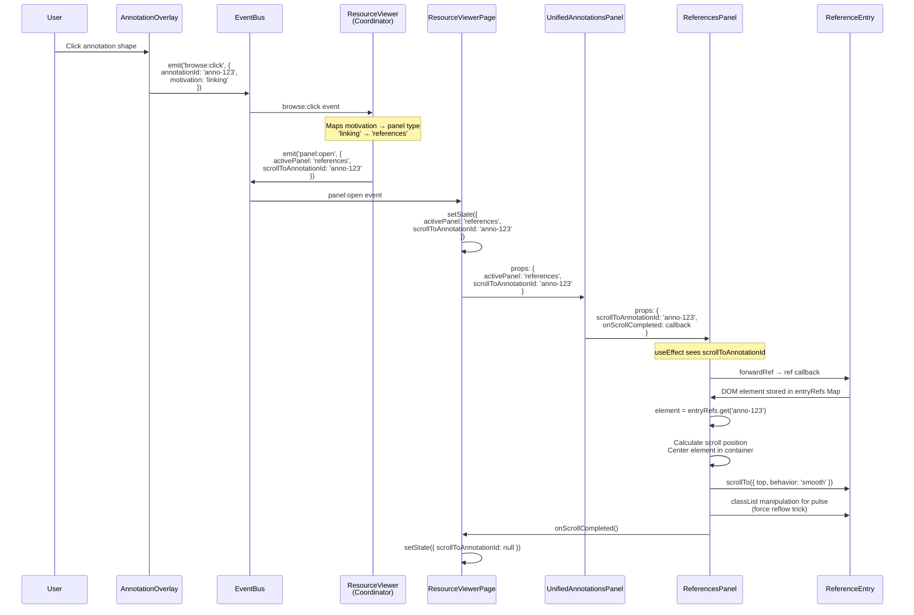
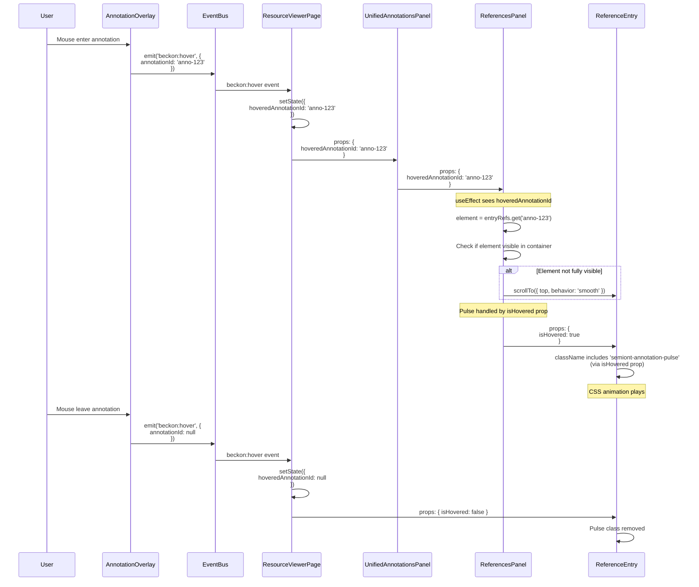
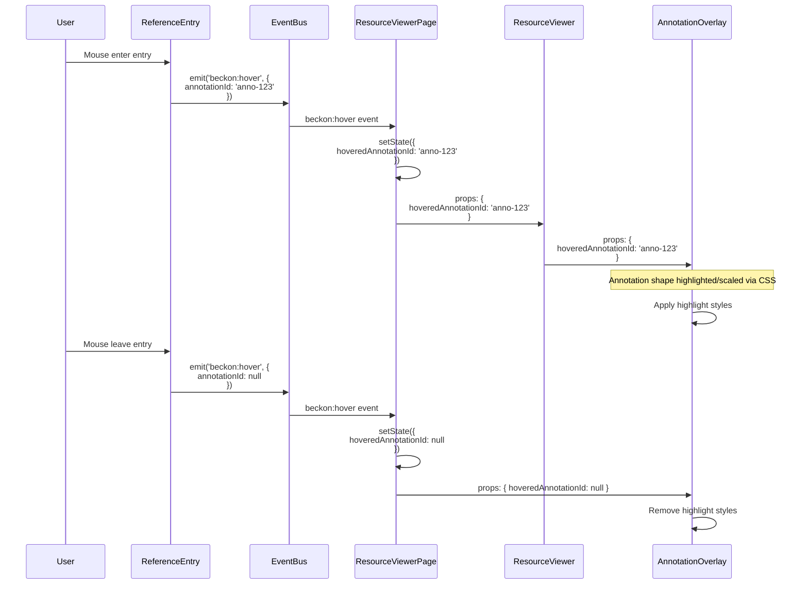

# Annotation Interaction Architecture

## Overview

This document explains how user interactions with annotations flow through the Semiont React UI architecture. It covers both click interactions (opening panels and scrolling to entries) and hover interactions (highlighting annotations and entries bidirectionally).

**Key Architectural Principle**: Events flow UP (user actions) → State flows DOWN (rendering)

## Three-Layer Architecture

### Layer 1: Data Layer (`@semiont/api-client`)

**Responsibility**: Owns annotation data and provides TypeScript types from OpenAPI spec.

**What it does**:
- CRUD operations for annotations
- TypeScript types generated from `specs/openapi.json`
- Utility functions for annotation manipulation (e.g., `getAnnotationExactText`, `getBodySource`)

**What it does NOT do**:
- NO knowledge of React, DOM, or UI state
- NO event emission or subscription
- NO component rendering logic

**Key Types**:
```typescript
import type { components } from '@semiont/api-client';

type Annotation = components['schemas']['Annotation'];
type Motivation = components['schemas']['Motivation'];
// 'linking' | 'commenting' | 'highlighting' | 'tagging' | 'assessing'
```

**Location**: `packages/api-client/`

### Layer 2: State Layer (React Components)

**Responsibility**: Owns UI state, manages rendering, coordinates data flow via props and callbacks.

**Key Components**:

1. **ResourceViewerPage** (`features/resource-viewer/components/ResourceViewerPage.tsx`)
   - Central coordinator for annotation state
   - Owns `annotations` array (updated via SSE)
   - Manages `hoveredAnnotationId`, `scrollToAnnotationId`, `activePanel`
   - Subscribes to coordination events
   - Passes state down via props

2. **UnifiedAnnotationsPanel** (`components/resource/panels/UnifiedAnnotationsPanel.tsx`)
   - Routes to specific panel based on active tab
   - Passes common props (`scrollToAnnotationId`, `hoveredAnnotationId`) to child panels

3. **Specific Panels** (e.g., `ReferencesPanel`, `CommentsPanel`)
   - Manages DOM refs via `useRef<Map<string, HTMLDivElement>>()`
   - Handles scroll and pulse effects based on props
   - Uses ref callbacks to track entry elements

4. **Entry Components** (e.g., `ReferenceEntry`, `CommentEntry`)
   - Uses `forwardRef` to expose DOM element to parent
   - Emits coordination events on user interaction
   - Applies CSS classes based on `isHovered` prop

**Data Flow Patterns**:
- **Props Down**: Parent passes data/state to children via props
- **Callbacks Up**: Children notify parents via callback props (e.g., `onScrollCompleted`)
- **Refs Via Callbacks**: Parents receive refs via `ref={(el) => setEntryRef(id, el)}`

**Location**: `packages/react-ui/src/components/`, `packages/react-ui/src/features/`

### Layer 3: Coordination Layer (Event Bus)

**Responsibility**: Cross-component coordination where direct props are impractical.

**Implementation**: Global singleton `mitt` instance exposed via `EventBusContext`.

**Valid Use Cases**:
- ✅ User clicks annotation on resource → Need to open panel (crosses major component boundaries)
- ✅ Bidirectional hover coordination (Resource ↔ Panel don't share parent-child relationship)
- ✅ Cross-panel communication

**Invalid Use Cases**:
- ❌ Parent → Child communication (use props instead)
- ❌ Tracking DOM refs (use React ref callbacks instead)
- ❌ Data persistence (use API client instead)

**Location**: `packages/react-ui/src/contexts/EventBusContext.tsx`

## Event Catalog

All events are defined in `EventBusContext.tsx` with TypeScript type safety:

```typescript
interface EventMap {
  // User clicks annotation on resource overlay
  'browse:click': {
    annotationId: string;
    motivation: Motivation;
  };

  // Bidirectional hover: annotation overlay ↔ panel entry
  'beckon:hover': {
    annotationId: string | null;  // null = unhover
  };

  // Coordinator requests panel to open with specific tab
  'panel:open': {
    activePanel: 'references' | 'comments' | 'highlights' | 'tags' | 'assessments';
    scrollToAnnotationId?: string;
  };

  // Reference creation and linking events
  'bind:create-manual': {
    annotationUri: string;
    title: string;
    entityTypes: string[];
  };

  'reference:generate': {
    annotationUri: string;
    resourceUri: string;
    options: { title: string };
  };

  'bind:link': {
    annotationUri: string;
    searchTerm: string;
  };

  // Annotation body updates
  'bind:update-body': {
    annotationUri: string;
    resourceId: string;
    operations: Array<{ op: string; item: any }>;
  };
}
```

## Interaction Flows

### Flow 1: Click Annotation → Open Panel → Scroll to Entry

**User Action**: User clicks an annotation on the resource (text selection, image shape, etc.)



**Key Points**:
- Event bus used to cross component boundaries (Overlay → Page)
- Props used for parent-child data flow (Page → Panel → Entry)
- Direct ref management eliminates timing issues
- Scroll happens synchronously when ref is available

### Flow 2: Hover Annotation → Highlight Entry

**User Action**: User hovers mouse over annotation on resource



**Key Points**:
- Central state management in ResourceViewerPage
- Bidirectional: Same event used for both directions
- Only scrolls entry if not already visible
- Pulse effect applied regardless of scroll

### Flow 3: Hover Entry → Highlight Annotation

**User Action**: User hovers mouse over annotation entry in panel



**Key Points**:
- Entry emits same event type as overlay
- ResourceViewerPage is single source of truth
- Both directions use identical coordination mechanism
- No special "reverse flow" logic needed

## Code Examples

### Example 1: Panel with Direct Ref Management

```typescript
// ReferencesPanel.tsx
export const ReferencesPanel: FC<Props> = ({
  annotations,
  scrollToAnnotationId,
  hoveredAnnotationId,
  onScrollCompleted,
  // ... other props
}) => {
  // Direct ref management - no event subscriptions needed
  const entryRefs = useRef<Map<string, HTMLDivElement>>(new Map());
  const containerRef = useRef<HTMLDivElement>(null);

  // Ref callback for entries
  const setEntryRef = useCallback((id: string, element: HTMLDivElement | null) => {
    if (element) {
      entryRefs.current.set(id, element);
    } else {
      entryRefs.current.delete(id);
    }
  }, []);

  // Handle click scroll (from scrollToAnnotationId prop)
  useEffect(() => {
    if (!scrollToAnnotationId) return;

    const element = entryRefs.current.get(scrollToAnnotationId);
    if (element && containerRef.current) {
      // Center element in container
      const elementTop = element.offsetTop;
      const containerHeight = containerRef.current.clientHeight;
      const elementHeight = element.offsetHeight;
      const scrollTo = elementTop - (containerHeight / 2) + (elementHeight / 2);

      containerRef.current.scrollTo({ top: scrollTo, behavior: 'smooth' });

      // Pulse effect
      element.classList.remove('semiont-annotation-pulse');
      void element.offsetWidth; // Force reflow
      element.classList.add('semiont-annotation-pulse');

      // Notify parent
      if (onScrollCompleted) {
        onScrollCompleted();
      }
    }
  }, [scrollToAnnotationId, onScrollCompleted]);

  // Handle hover scroll only (pulse is handled by isHovered prop on entry)
  useEffect(() => {
    if (!hoveredAnnotationId) return;

    const element = entryRefs.current.get(hoveredAnnotationId);
    if (element && containerRef.current) {
      // Only scroll if not fully visible
      const container = containerRef.current;
      const elementRect = element.getBoundingClientRect();
      const containerRect = container.getBoundingClientRect();

      const isVisible =
        elementRect.top >= containerRect.top &&
        elementRect.bottom <= containerRect.bottom;

      if (!isVisible) {
        const elementTop = element.offsetTop;
        const containerHeight = container.clientHeight;
        const elementHeight = element.offsetHeight;
        const scrollTo = elementTop - (containerHeight / 2) + (elementHeight / 2);

        container.scrollTo({ top: scrollTo, behavior: 'smooth' });
      }

      // Pulse effect is handled by isHovered prop passed to ReferenceEntry
      // This keeps styling in the component's render method, not in imperative DOM manipulation
    }
  }, [hoveredAnnotationId]);

  return (
    <div ref={containerRef} className="semiont-references-panel">
      {sortedAnnotations.map((reference) => (
        <ReferenceEntry
          key={reference.id}
          reference={reference}
          isFocused={reference.id === focusedAnnotationId}
          isHovered={reference.id === hoveredAnnotationId}
          ref={(el) => setEntryRef(reference.id, el)}
        />
      ))}
    </div>
  );
};
```

### Example 2: Entry Component with forwardRef

```typescript
// ReferenceEntry.tsx
interface ReferenceEntryProps {
  reference: Annotation;
  isFocused: boolean;
  isHovered?: boolean;  // For pulse effect from parent
  routes: RouteBuilder;
  annotateMode?: boolean;
  isGenerating?: boolean;
}

export const ReferenceEntry = forwardRef<HTMLDivElement, ReferenceEntryProps>(
  function ReferenceEntry(
    {
      reference,
      isFocused,
      isHovered = false,
      routes,
      annotateMode = true,
      isGenerating = false,
    },
    ref
  ) {
    const eventBus = useEventBus();

    return (
      <div
        ref={ref}
        className={`semiont-annotation-entry${isHovered ? ' semiont-annotation-pulse' : ''}`}
        data-type="reference"
        data-focused={isFocused ? 'true' : 'false'}
        onClick={() => {
          // Click → Open panel
          eventBus.emit('browse:click', {
            annotationId: reference.id,
            motivation: reference.motivation
          });
        }}
        onMouseEnter={() => {
          // Hover entry → Highlight annotation on resource
          eventBus.emit('beckon:hover', { annotationId: reference.id });
        }}
        onMouseLeave={() => {
          // Unhover entry → Clear annotation highlight
          eventBus.emit('beckon:hover', { annotationId: null });
        }}
      >
        {/* Entry content */}
      </div>
    );
  }
);
```

### Example 3: Central State Coordinator

```typescript
// ResourceViewerPage.tsx
export const ResourceViewerPage: FC<Props> = ({ resourceId }) => {
  const [annotations, setAnnotations] = useState<Annotation[]>([]);
  const [hoveredAnnotationId, setHoveredAnnotationId] = useState<string | null>(null);
  const [scrollToAnnotationId, setScrollToAnnotationId] = useState<string | null>(null);
  const [activePanel, setActivePanel] = useState<PanelType>('references');

  // Subscribe to coordination events
  useEventSubscriptions({
    'beckon:hover': ({ annotationId }: { annotationId: string | null }) => {
      // Central hover state - used by both resource overlay and panel entries
      setHoveredAnnotationId(annotationId);
    },

    'panel:open': ({ activePanel, scrollToAnnotationId }: {
      activePanel: PanelType;
      scrollToAnnotationId?: string;
    }) => {
      setActivePanel(activePanel);
      if (scrollToAnnotationId) {
        setScrollToAnnotationId(scrollToAnnotationId);
      }
    },
  });

  const handleScrollCompleted = useCallback(() => {
    // Clear scroll target after scroll completes
    setScrollToAnnotationId(null);
  }, []);

  return (
    <div className="resource-viewer-page">
      <ResourceViewer
        resourceId={resourceId}
        annotations={annotations}
        hoveredAnnotationId={hoveredAnnotationId}  // Resource highlights annotation
      />

      <UnifiedAnnotationsPanel
        annotations={annotations}
        activePanel={activePanel}
        scrollToAnnotationId={scrollToAnnotationId}  // Panel scrolls to entry
        hoveredAnnotationId={hoveredAnnotationId}     // Panel pulses entry
        onScrollCompleted={handleScrollCompleted}
      />
    </div>
  );
};
```

## Decision Matrix: Event Bus vs Props

| Scenario | Use Event Bus | Use Props | Why |
|----------|---------------|-----------|-----|
| User clicks annotation on resource | ✅ | ❌ | Crosses major component boundaries (ResourceViewer → ResourceViewerPage → UnifiedAnnotationsPanel) |
| User hovers annotation | ✅ | ❌ | Bidirectional coordination: Resource ↔ Panel need same state |
| Parent needs child's DOM ref | ❌ | ✅ | Standard React pattern (forwardRef/callback) |
| Parent passes data to child | ❌ | ✅ | Props are React's primary data flow mechanism |
| Child notifies parent of action | ❌ | ✅ | Callback props (e.g., `onScrollCompleted`) |
| Cross-panel communication | ✅ | ❌ | Panels don't have direct parent-child relationship |
| Tracking UI state (scroll position, focus) | ❌ | ✅ | Component-local state or props from parent |

## Common Pitfalls and Solutions

### Pitfall 1: Mixing DOM Manipulation with Props for Styling

**❌ WRONG - Fighting over the same CSS class**:

```typescript
// Panel useEffect - adds pulse via DOM
useEffect(() => {
  if (!hoveredAnnotationId) return undefined;
  const element = entryRefs.current.get(hoveredAnnotationId);
  if (!element) return undefined;

  const timeoutId = setTimeout(() => {
    element.classList.add('semiont-annotation-pulse');  // DOM manipulation
  }, 100);

  return () => {
    clearTimeout(timeoutId);
    element.classList.remove('semiont-annotation-pulse');
  };
}, [hoveredAnnotationId]);

// Entry component - also tries to control pulse via className
<div
  ref={ref}
  className={`semiont-annotation-entry${isHovered ? ' semiont-annotation-pulse' : ''}`}
>
```

**Problem**: Two mechanisms fighting over the same CSS class:

1. Panel's useEffect adds/removes class via DOM manipulation
2. Entry's className binding adds class via React render
3. CSS animation won't retrigger because class is already present when React adds it
4. Cleanup conflicts: React removes class on re-render, useEffect cleanup also tries to remove it

**✅ CORRECT - Single source of truth**:

```typescript
// Panel useEffect - ONLY handles scrolling
useEffect(() => {
  if (!hoveredAnnotationId) return;
  const element = entryRefs.current.get(hoveredAnnotationId);
  if (!element || !containerRef.current) return;

  // Check visibility and scroll if needed
  const isVisible = /* ... */;
  if (!isVisible) {
    containerRef.current.scrollTo({ top: scrollTo, behavior: 'smooth' });
  }

  // Pulse effect is handled by isHovered prop on entry - don't touch it here!
}, [hoveredAnnotationId]);

// Entry component - Single source of truth for pulse styling
<div
  ref={ref}
  className={`semiont-annotation-entry${isHovered ? ' semiont-annotation-pulse' : ''}`}
>
```

**Why this works**:

- Separation of concerns: useEffect handles **behavior** (scrolling), props handle **styling** (pulse)
- React controls className, no imperative DOM manipulation
- Class changes trigger CSS animation properly
- No cleanup conflicts
- Easier to reason about and test

### Pitfall 2: Using Events for Parent-Child Communication

**❌ WRONG**:

```typescript
// Child emits event with DOM element
useEffect(() => {
  eventBus.emit('annotation:ref-update', {
    annotationId: reference.id,
    element: divRef.current
  });
}, [reference.id]);

// Parent subscribes to event
useEventSubscriptions({
  'annotation:ref-update': ({ annotationId, element }) => {
    entryRefs.current.set(annotationId, element);
  }
});
```

**✅ CORRECT - Use ref callbacks**:

```typescript
// Parent provides ref callback
const setEntryRef = useCallback((id: string, element: HTMLDivElement | null) => {
  if (element) {
    entryRefs.current.set(id, element);
  } else {
    entryRefs.current.delete(id);
  }
}, []);

// Child uses forwardRef and parent's callback
<ReferenceEntry
  key={reference.id}
  reference={reference}
  ref={(el) => setEntryRef(reference.id, el)}
/>
```

## Architectural Invariants

These rules MUST be followed:

1. **Data Layer has NO React knowledge**
   - `@semiont/api-client` cannot import React, DOM types, or UI state
   - Only TypeScript types and pure functions

2. **Event Bus is for coordination ONLY**
   - NOT for parent-child communication (use props)
   - NOT for DOM element tracking (use refs)
   - NOT for data persistence (use API)

3. **State flows DOWN, Events flow UP**
   - Parent manages state, passes via props to children
   - Children emit events for cross-component coordination
   - Children use callbacks to notify parent of local actions

4. **One source of truth per state**
   - `hoveredAnnotationId`: Owned by ResourceViewerPage
   - `annotations`: Owned by ResourceViewerPage (via SSE)
   - `scrollToAnnotationId`: Owned by ResourceViewerPage (set by panel:open event)
   - DOM refs: Owned by panel components (via Map)

5. **Refs are synchronous**
   - No "pending" ref patterns
   - No event emission for ref updates
   - Refs available immediately when component mounts via callback

## Related Documentation

- **OpenAPI Spec**: `specs/openapi.json` - Source of truth for annotation types
- **Event Bus Context**: `packages/react-ui/src/contexts/EventBusContext.tsx` - Event type definitions
- **Annotation Utilities**: `packages/api-client/src/` - Pure functions for annotation manipulation
- **Architecture Compliance**: `REMOVE-REF-UPDATE.md` - Migration plan and architectural rationale
