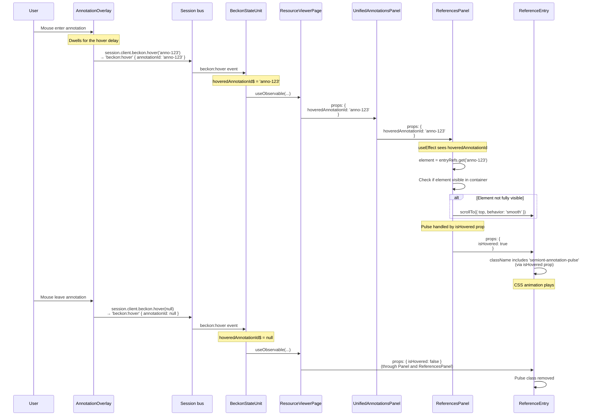
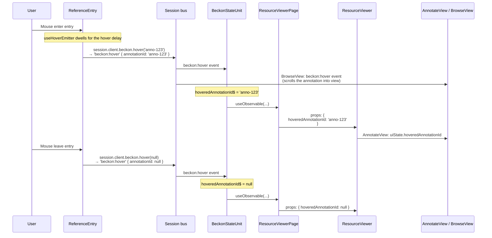

# Annotation Interaction Architecture

## Overview

This document explains how user interactions with annotations flow through the Semiont React UI architecture. It covers both click interactions (opening panels and scrolling to entries) and hover interactions (highlighting annotations and entries bidirectionally).

**Key Architectural Principle**: Events flow UP (user actions) → State flows DOWN (rendering)

## Three-Layer Architecture

### Layer 1: Data Layer (`@semiont/core` + `@semiont/sdk`)

**Responsibility**: Owns annotation data and provides TypeScript types from OpenAPI spec.

**What it does**:
- CRUD operations for annotations (via the SDK)
- TypeScript types generated from the OpenAPI spec, `specs/src/openapi.json` (in `@semiont/core`)
- Utility functions for annotation manipulation (e.g., `getAnnotationExactText`, `getBodySource`) (in `@semiont/core`)

**What it does NOT do**:
- NO knowledge of React, DOM, or UI state
- NO component rendering logic

**Key Types**:
```typescript
import type { components } from '@semiont/core';

type Annotation = components['schemas']['Annotation'];
type Motivation = components['schemas']['Motivation'];
// 'linking' | 'commenting' | 'highlighting' | 'tagging' | 'assessing'
```

**Location**: types and annotation utilities in `packages/core/`; the SDK in `packages/sdk/`

### Layer 2: State Layer (React Components)

**Responsibility**: Owns UI state, manages rendering, coordinates data flow via props and callbacks.

**Key Components**:

1. **ResourceViewerPage** (`features/resource-viewer/components/ResourceViewerPage.tsx`)
   - Central coordinator for annotation state
   - Composes the resource-viewer page state unit (`createResourceViewerPageStateUnit`), whose units subscribe to the coordination events
   - Reads `annotations` (an SDK live query the SDK keeps fresh off bus events), `hoveredAnnotationId` (the beckon state unit), and `activePanel` / `scrollToAnnotationId` (the shell state unit) with `useObservable`
   - Passes state down via props

2. **UnifiedAnnotationsPanel** (`components/resource/panels/UnifiedAnnotationsPanel.tsx`)
   - Routes to specific panel based on active tab
   - Passes common props (`scrollToAnnotationId`, `hoveredAnnotationId`) to child panels

3. **Specific Panels** (e.g., `ReferencesPanel`, `CommentsPanel`)
   - Manages DOM refs via `useRef<Map<string, HTMLDivElement>>()`
   - Handles scroll and pulse effects based on props
   - Uses ref callbacks to track entry elements

4. **Entry Components** (e.g., `ReferenceEntry`, `CommentEntry`)
   - Takes `ref` as an ordinary prop to expose its DOM element to the parent
   - Emits coordination events on user interaction
   - Applies CSS classes based on `isHovered` prop

**Data Flow Patterns**:
- **Props Down**: Parent passes data/state to children via props
- **Callbacks Up**: Children notify parents via callback props (e.g., `onScrollCompleted`)
- **Refs Via Callbacks**: Parents receive refs via `ref={(el) => setEntryRef(id, el)}`

**Location**: `packages/react-ui/src/components/`, `packages/react-ui/src/features/`

### Layer 3: Coordination Layer (Event Bus)

**Responsibility**: Cross-component coordination where direct props are impractical.

**Implementation**: Each session's client owns an `EventBus` (`session.client.bus`) for the
session's channels; the browser holds a second, app-scoped one for shell channels (`panel:*`).

**Valid Use Cases**:
- ✅ User clicks annotation on resource → Need to open panel (crosses major component boundaries)
- ✅ Bidirectional hover coordination (Resource ↔ Panel don't share parent-child relationship)
- ✅ Cross-panel communication

**Invalid Use Cases**:
- ❌ Parent → Child communication (use props instead)
- ❌ Tracking DOM refs (use React ref callbacks instead)
- ❌ Data persistence (use the SDK instead)

**Location**: `packages/core/src/event-bus.ts` (the bus), `packages/core/src/bus-protocol.ts` (the channels)

## Event Catalog

All events are typed by `EventMap` in `@semiont/core`, generated from the spec. The ids they
carry are typed (`AnnotationId`, `ResourceId`), not `string`:

```typescript
// User clicks annotation on resource overlay. `browse:click` may also carry
// `anchorRect`, local-only viewport geometry for anchoring a popup: it never
// crosses the wire, so a bridged-in remote click arrives without one.
const click: EventMap['browse:click'] = { annotationId };

// Bidirectional hover: annotation overlay ↔ panel entry
const hover: EventMap['beckon:hover'] = { annotationId: null }; // null = unhover

// Coordinator requests the annotations panel, scrolled to an entry; the
// motivation picks the tab
const open: EventMap['panel:open'] = {
  panel: 'annotations',
  scrollToAnnotationId: annotationId,
  motivation: 'linking',
};

// Reference resolution wizard
const initiate: EventMap['bind:initiate'] = {
  annotationId,
  resourceId,
  defaultTitle: 'Ada Lovelace',
  entityTypes: ['Person'],
};

// Annotation body updates
const updateBody: EventMap['bind:update-body'] = {
  annotationId,
  resourceId,
  operations: [{ op: 'remove', item: { type: 'SpecificResource', source: resourceId, purpose: 'linking' } }],
};
```

## Interaction Flows

### Flow 1: Click Annotation → Open Panel → Scroll to Entry

**User Action**: User clicks an annotation on the resource (text selection, image shape, etc.)

```mermaid
sequenceDiagram
    participant User
    participant Overlay as AnnotationOverlay
    participant Bus as Session bus
    participant Coord as ResourceViewer<br/>(Coordinator)
    participant Page as ResourceViewerPage
    participant App as App bus<br/>(SemiontBrowser)
    participant Shell as ShellStateUnit
    participant Panel as UnifiedAnnotationsPanel
    participant Specific as ReferencesPanel
    participant Entry as ReferenceEntry

    User->>Overlay: Click annotation shape
    Overlay->>Bus: session.client.browse.click('anno-123')<br/>→ 'browse:click' { annotationId: 'anno-123' }
    Bus->>Coord: browse:click event
    Bus->>Specific: browse:click event<br/>(entry marked focused for 3s)

    Note over Coord: Resolves the annotation by id;<br/>its annotator has a side panel<br/>and the click action is 'detail'

    Coord->>Page: onOpenPanel({<br/>  panel: 'annotations',<br/>  scrollToAnnotationId: 'anno-123',<br/>  motivation: 'linking'<br/>})
    Page->>App: browser.emit('panel:open', event)
    App->>Shell: panel:open event

    Note over Shell: activePanel$ = 'annotations'<br/>scrollToAnnotationId$ = 'anno-123'<br/>panelInitialTab$ = 'reference'<br/>(annotatorKeyForMotivation('linking'))

    Shell->>Page: useObservable(...)
    Page->>Panel: props: {<br/>  initialTab: 'reference',<br/>  scrollToAnnotationId: 'anno-123'<br/>}
    Panel->>Specific: props: {<br/>  scrollToAnnotationId: 'anno-123',<br/>  onScrollCompleted: callback<br/>}

    Note over Specific: useEffect sees scrollToAnnotationId

    Specific->>Entry: ref callback
    Entry->>Specific: DOM element stored in entryRefs Map

    Specific->>Specific: element = entryRefs.get('anno-123')
    Specific->>Specific: Calculate scroll position<br/>Center element in container
    Specific->>Entry: scrollTo({ top, behavior: 'smooth' })
    Specific->>Entry: classList manipulation for pulse<br/>(force reflow trick)
    Specific->>Shell: onScrollCompleted()

    Note over Shell: scrollToAnnotationId$ = null
```

**Key Points**:
- Event buses cross component boundaries: the session bus carries the click to ResourceViewer, and the app bus carries `panel:open` to the shell state unit
- ResourceViewer never emits `panel:open` itself: the host owns its panels and receives the request through `onOpenPanel`
- Props used for parent-child data flow (Page → Panel → Entry)
- Direct ref management eliminates timing issues
- Scroll happens synchronously when ref is available

### Flow 2: Hover Annotation → Highlight Entry

**User Action**: User hovers mouse over annotation on resource


```mermaid
sequenceDiagram
    participant User
    participant Overlay as AnnotationOverlay
    participant Bus as Session bus
    participant Beckon as BeckonStateUnit
    participant Page as ResourceViewerPage
    participant Panel as UnifiedAnnotationsPanel
    participant Specific as ReferencesPanel
    participant Entry as ReferenceEntry

    User->>Overlay: Mouse enter annotation
    Note over Overlay: Dwells for the hover delay
    Overlay->>Bus: session.client.beckon.hover('anno-123')<br/>→ 'beckon:hover' { annotationId: 'anno-123' }
    Bus->>Beckon: beckon:hover event

    Note over Beckon: hoveredAnnotationId$ = 'anno-123'

    Beckon->>Page: useObservable(...)
    Page->>Panel: props: {<br/>  hoveredAnnotationId: 'anno-123'<br/>}
    Panel->>Specific: props: {<br/>  hoveredAnnotationId: 'anno-123'<br/>}

    Note over Specific: useEffect sees hoveredAnnotationId

    Specific->>Specific: element = entryRefs.get('anno-123')
    Specific->>Specific: Check if element visible in container

    alt Element not fully visible
        Specific->>Entry: scrollTo({ top, behavior: 'smooth' })
    end

    Note over Specific: Pulse handled by isHovered prop

    Specific->>Entry: props: {<br/>  isHovered: true<br/>}
    Entry->>Entry: className includes 'semiont-annotation-pulse'<br/>(via isHovered prop)

    Note over Entry: CSS animation plays

    User->>Overlay: Mouse leave annotation
    Overlay->>Bus: session.client.beckon.hover(null)<br/>→ 'beckon:hover' { annotationId: null }
    Bus->>Beckon: beckon:hover event

    Note over Beckon: hoveredAnnotationId$ = null

    Beckon->>Page: useObservable(...)
    Page->>Entry: props: { isHovered: false }<br/>(through Panel and ReferencesPanel)
    Entry->>Entry: Pulse class removed
```

**Key Points**:
- Hover state lives in the beckon state unit; ResourceViewerPage reads it and passes it down
- Bidirectional: Same event used for both directions
- Only scrolls entry if not already visible
- Pulse effect applied regardless of scroll

### Flow 3: Hover Entry → Highlight Annotation

**User Action**: User hovers mouse over annotation entry in panel


```mermaid
sequenceDiagram
    participant User
    participant Entry as ReferenceEntry
    participant Bus as Session bus
    participant Beckon as BeckonStateUnit
    participant Page as ResourceViewerPage
    participant Viewer as ResourceViewer
    participant View as AnnotateView / BrowseView

    User->>Entry: Mouse enter entry
    Note over Entry: useHoverEmitter dwells for the hover delay
    Entry->>Bus: session.client.beckon.hover('anno-123')<br/>→ 'beckon:hover' { annotationId: 'anno-123' }
    Bus->>Beckon: beckon:hover event
    Bus->>View: BrowseView: beckon:hover event<br/>(scrolls the annotation into view)

    Note over Beckon: hoveredAnnotationId$ = 'anno-123'

    Beckon->>Page: useObservable(...)
    Page->>Viewer: props: {<br/>  hoveredAnnotationId: 'anno-123'<br/>}
    Viewer->>View: AnnotateView: uiState.hoveredAnnotationId

    User->>Entry: Mouse leave entry
    Entry->>Bus: session.client.beckon.hover(null)<br/>→ 'beckon:hover' { annotationId: null }
    Bus->>Beckon: beckon:hover event

    Note over Beckon: hoveredAnnotationId$ = null

    Beckon->>Page: useObservable(...)
    Page->>Viewer: props: { hoveredAnnotationId: null }
```

**Key Points**:
- Entry emits same event type as overlay
- The beckon state unit is the single source of truth
- Both directions use identical coordination mechanism
- No special "reverse flow" logic needed

## Code Examples

### Example 1: Panel with Direct Ref Management

```tsx
// ReferencesPanel.tsx — the ref, scroll and focus handling
import { getTargetSelector, getTextPositionSelector } from '@semiont/core';

function ReferencesPanelExcerpt({
  session,
  annotations = [],
  scrollToAnnotationId,
  hoveredAnnotationId,
  onScrollCompleted,
  // ... other props
}: React.ComponentProps<typeof ReferencesPanel>) {
  const [focusedAnnotationId, setFocusedAnnotationId] = useState<string | null>(null);

  // Direct ref management - refs, not events
  const entryRefs = useRef<Map<string, HTMLDivElement>>(new Map());
  const containerRef = useRef<HTMLDivElement>(null);

  // Sort annotations by their position in the resource
  const sortedAnnotations = useMemo(() => [...annotations].sort((a, b) => {
    const aSelector = getTextPositionSelector(getTargetSelector(a.target));
    const bSelector = getTextPositionSelector(getTargetSelector(b.target));
    if (!aSelector || !bSelector) return 0;
    return aSelector.start - bSelector.start;
  }), [annotations]);

  // Ref callback for entries
  const setEntryRef = useCallback((id: string, element: HTMLDivElement | null) => {
    if (element) {
      entryRefs.current.set(id, element);
    } else {
      entryRefs.current.delete(id);
    }
  }, []);

  // Handle click scroll (from scrollToAnnotationId prop)
  useEffect(() => {
    if (!scrollToAnnotationId) return;

    const element = entryRefs.current.get(scrollToAnnotationId);
    if (element && containerRef.current) {
      // Center element in container
      const elementTop = element.offsetTop;
      const containerHeight = containerRef.current.clientHeight;
      const elementHeight = element.offsetHeight;
      const scrollTo = elementTop - (containerHeight / 2) + (elementHeight / 2);

      containerRef.current.scrollTo({ top: scrollTo, behavior: 'smooth' });

      // Pulse effect
      element.classList.remove('semiont-annotation-pulse');
      void element.offsetWidth; // Force reflow
      element.classList.add('semiont-annotation-pulse');

      // Notify parent
      if (onScrollCompleted) {
        onScrollCompleted();
      }
    }
  }, [scrollToAnnotationId]);

  // Handle hover scroll only (pulse is handled by isHovered prop on entry)
  useEffect(() => {
    if (!hoveredAnnotationId) return;

    const element = entryRefs.current.get(hoveredAnnotationId);
    if (!element || !containerRef.current) return;

    // Only scroll if not fully visible
    const container = containerRef.current;
    const elementRect = element.getBoundingClientRect();
    const containerRect = container.getBoundingClientRect();

    const isVisible =
      elementRect.top >= containerRect.top &&
      elementRect.bottom <= containerRect.bottom;

    if (!isVisible) {
      const elementTop = element.offsetTop;
      const containerHeight = container.clientHeight;
      const elementHeight = element.offsetHeight;
      const scrollTo = elementTop - (containerHeight / 2) + (elementHeight / 2);

      container.scrollTo({ top: scrollTo, behavior: 'smooth' });
    }

    // Pulse effect is handled by isHovered prop passed to ReferenceEntry
    // This keeps styling in the component's render method, not in imperative DOM manipulation
  }, [hoveredAnnotationId]);

  // A click on an annotation, wherever it happens, focuses its entry for three seconds
  useSessionEventSubscriptions(session, {
    'browse:click': ({ annotationId }) => {
      setFocusedAnnotationId(annotationId);
      setTimeout(() => setFocusedAnnotationId(null), 3000);
    },
  });

  return (
    <div ref={containerRef} className="semiont-panel__content">
      {sortedAnnotations.map((reference) => (
        <ReferenceEntry
          session={session}
          key={reference.id}
          reference={reference}
          isFocused={reference.id === focusedAnnotationId}
          isHovered={reference.id === hoveredAnnotationId}
          ref={(el) => setEntryRef(reference.id, el)}
        />
      ))}
    </div>
  );
}
```

### Example 2: Entry Component with a `ref` Prop

The entry takes `ref` as an ordinary prop and hands it to its root element.

```tsx
// ReferenceEntry.tsx — the interaction wiring
function ReferenceEntryExcerpt({
  session,
  reference,
  isFocused,
  isHovered = false,  // For pulse effect from parent
  ref,
}: React.ComponentProps<typeof ReferenceEntry>) {
  // Hover entry → highlight annotation on resource: emits beckon:hover after
  // the hover delay, and beckon:hover with null on leave
  const hoverProps = useHoverEmitter(session, reference.id);

  return (
    <div
      ref={ref}
      className={`semiont-annotation-entry${isHovered ? ' semiont-annotation-pulse' : ''}`}
      data-type="reference"
      data-focused={isFocused ? 'true' : 'false'}
      onClick={() => {
        // Click → Open panel
        // The id is the whole address; the viewer derives the motivation
        // from the annotation it names.
        session?.client.browse.click(reference.id);
      }}
      {...hoverProps}
    >
      {/* Entry content */}
    </div>
  );
}
```

### Example 3: Central State Coordinator

The page holds no coordination state of its own: the state units it composes subscribe to the
events, and the page reads their observables and passes the values down.

```tsx
// ResourceViewerPage.tsx — the coordination
function ResourceViewerPageExcerpt() {
  const browser = useSemiont();
  const session = useObservable(browser.activeSession$) ?? null;

  // The page state unit composes the flow units: beckon (hover), mark
  // (pending annotation) and the app-scoped shell unit (panels, scroll target)
  const browseStateUnit = useShellStateUnit();
  const stateUnit = useSessionStateUnit(
    session ?? undefined,
    (s) => createResourceViewerPageStateUnit(s, rId, locale, browseStateUnit),
  );

  const annotations = useObservable(stateUnit?.annotations.value$) ?? [];
  const groups = useObservable(stateUnit?.annotationGroups$);
  const pendingAnnotation = useObservable(stateUnit?.mark.pendingAnnotation$) ?? null;
  // Central hover state - set by beckon:hover from both the resource and the panel
  const hoveredAnnotationId = useObservable(stateUnit?.beckon.hoveredAnnotationId$) ?? null;
  // Set by panel:open, cleared by onScrollCompleted
  const scrollToAnnotationId = useObservable(stateUnit?.browse.scrollToAnnotationId$) ?? null;
  const panelInitialTab = useObservable(stateUnit?.browse.panelInitialTab$) ?? null;

  return (
    <div className="semiont-document-viewer">
      <ResourceViewer
        resource={{ ...resource, content }}
        annotations={groups ?? { highlights: [], comments: [], assessments: [], references: [], tags: [] }}
        session={session}
        onOpenPanel={(event) => browser.emit('panel:open', event)}  // The host owns its panels
        hoveredAnnotationId={hoveredAnnotationId}  // Resource highlights annotation
      />

      <UnifiedAnnotationsPanel
        session={session}
        annotations={annotations}
        annotators={ANNOTATORS}
        resourceId={rId}
        pendingAnnotation={pendingAnnotation}
        initialTab={panelInitialTab?.tab}  // The clicked annotation's tab
        initialTabGeneration={panelInitialTab?.generation}
        scrollToAnnotationId={scrollToAnnotationId}  // Panel scrolls to entry
        hoveredAnnotationId={hoveredAnnotationId}     // Panel pulses entry
        onScrollCompleted={stateUnit?.browse.onScrollCompleted}
        Link={Link}
        routes={routes}
      />
    </div>
  );
}
```

## Decision Matrix: Event Bus vs Props

| Scenario | Use Event Bus | Use Props | Why |
|----------|---------------|-----------|-----|
| User clicks annotation on resource | ✅ | ❌ | Crosses major component boundaries (ResourceViewer → ResourceViewerPage → UnifiedAnnotationsPanel) |
| User hovers annotation | ✅ | ❌ | Bidirectional coordination: Resource ↔ Panel need same state |
| Parent needs child's DOM ref | ❌ | ✅ | Standard React pattern (`ref` prop with a callback) |
| Parent passes data to child | ❌ | ✅ | Props are React's primary data flow mechanism |
| Child notifies parent of action | ❌ | ✅ | Callback props (e.g., `onScrollCompleted`) |
| Cross-panel communication | ✅ | ❌ | Panels don't have direct parent-child relationship |
| Tracking UI state (scroll position, focus) | ❌ | ✅ | Component-local state or props from parent |

## Common Pitfalls and Solutions

### Pitfall 1: Mixing DOM Manipulation with Props for Styling

**❌ WRONG - Fighting over the same CSS class**:

```tsx
// Panel - adds pulse via DOM
function Panel({ hoveredAnnotationId }: { hoveredAnnotationId: string | null }) {
  const entryRefs = useRef<Map<string, HTMLDivElement>>(new Map());

  useEffect(() => {
    if (!hoveredAnnotationId) return undefined;
    const element = entryRefs.current.get(hoveredAnnotationId);
    if (!element) return undefined;

    const timeoutId = setTimeout(() => {
      element.classList.add('semiont-annotation-pulse');  // DOM manipulation
    }, 100);

    return () => {
      clearTimeout(timeoutId);
      element.classList.remove('semiont-annotation-pulse');
    };
  }, [hoveredAnnotationId]);
  // ...
}

// Entry component - also tries to control pulse via className
function Entry({ isHovered, ref }: { isHovered: boolean; ref: React.Ref<HTMLDivElement> }) {
  return (
    <div
      ref={ref}
      className={`semiont-annotation-entry${isHovered ? ' semiont-annotation-pulse' : ''}`}
    />
  );
}
```

**Problem**: Two mechanisms fighting over the same CSS class:

1. Panel's useEffect adds/removes class via DOM manipulation
2. Entry's className binding adds class via React render
3. CSS animation won't retrigger because class is already present when React adds it
4. Cleanup conflicts: React removes class on re-render, useEffect cleanup also tries to remove it

**✅ CORRECT - Single source of truth**:

```tsx
// Panel - ONLY handles scrolling
function Panel({ hoveredAnnotationId }: { hoveredAnnotationId: string | null }) {
  const entryRefs = useRef<Map<string, HTMLDivElement>>(new Map());
  const containerRef = useRef<HTMLDivElement>(null);

  useEffect(() => {
    if (!hoveredAnnotationId) return;
    const element = entryRefs.current.get(hoveredAnnotationId);
    const container = containerRef.current;
    if (!element || !container) return;

    // Check visibility and scroll if needed
    const elementRect = element.getBoundingClientRect();
    const containerRect = container.getBoundingClientRect();
    const isVisible = elementRect.top >= containerRect.top && elementRect.bottom <= containerRect.bottom;
    if (!isVisible) {
      const scrollTo = element.offsetTop - container.clientHeight / 2 + element.offsetHeight / 2;
      container.scrollTo({ top: scrollTo, behavior: 'smooth' });
    }

    // Pulse effect is handled by isHovered prop on entry - don't touch it here!
  }, [hoveredAnnotationId]);
  // ...
}

// Entry component - Single source of truth for pulse styling
function Entry({ isHovered, ref }: { isHovered: boolean; ref: React.Ref<HTMLDivElement> }) {
  return (
    <div
      ref={ref}
      className={`semiont-annotation-entry${isHovered ? ' semiont-annotation-pulse' : ''}`}
    />
  );
}
```

**Why this works**:

- Separation of concerns: useEffect handles **behavior** (scrolling), props handle **styling** (pulse)
- React controls className, no imperative DOM manipulation
- Class changes trigger CSS animation properly
- No cleanup conflicts
- Easier to reason about and test

## Architectural Invariants

These rules MUST be followed:

1. **Data Layer has NO React knowledge**
   - `@semiont/core` (types and annotation utilities) and `@semiont/sdk` cannot import React, DOM types, or UI state
   - Only TypeScript types and pure functions

2. **Event Bus is for coordination ONLY**
   - NOT for parent-child communication (use props)
   - NOT for DOM element tracking (use refs)
   - NOT for data persistence (use the SDK)

3. **State flows DOWN, Events flow UP**
   - Parent manages state, passes via props to children
   - Children emit events for cross-component coordination
   - Children use callbacks to notify parent of local actions

4. **One source of truth per state**
   - `hoveredAnnotationId`: Owned by the beckon state unit (set by beckon:hover), read by ResourceViewerPage
   - `annotations`: Owned by the SDK's `browse.annotations` live query, read through the page state unit
   - `scrollToAnnotationId`: Owned by the shell state unit (set by panel:open, cleared by `onScrollCompleted`)
   - DOM refs: Owned by panel components (via Map)

5. **Refs are synchronous**
   - No "pending" ref patterns
   - No event emission for ref updates
   - Refs available immediately when component mounts via callback

## Related Documentation

- **OpenAPI Spec**: `specs/src/openapi.json`, and `specs/src/components/schemas/Annotation.json` in it - Source of truth for annotation types
- **Event channels**: `packages/core/src/bus-protocol.ts` - `EventMap`, the channel type definitions
- **Annotation Utilities**: `packages/core/src/web-annotation-utils.ts` - Pure functions for annotation manipulation
